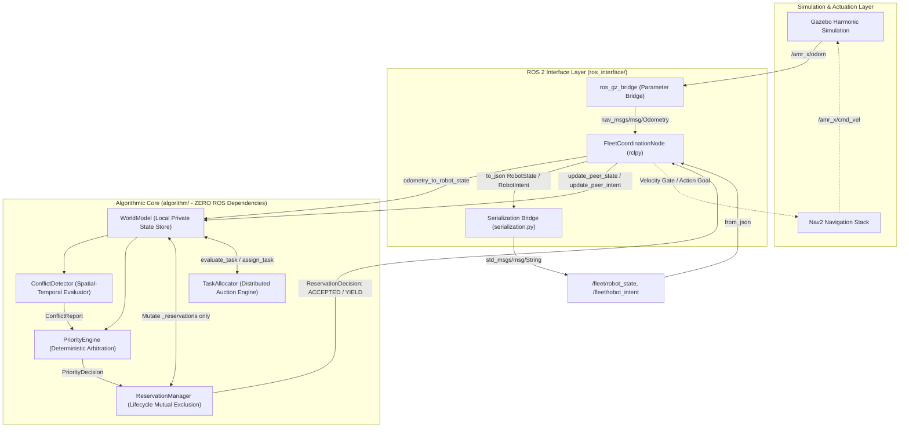
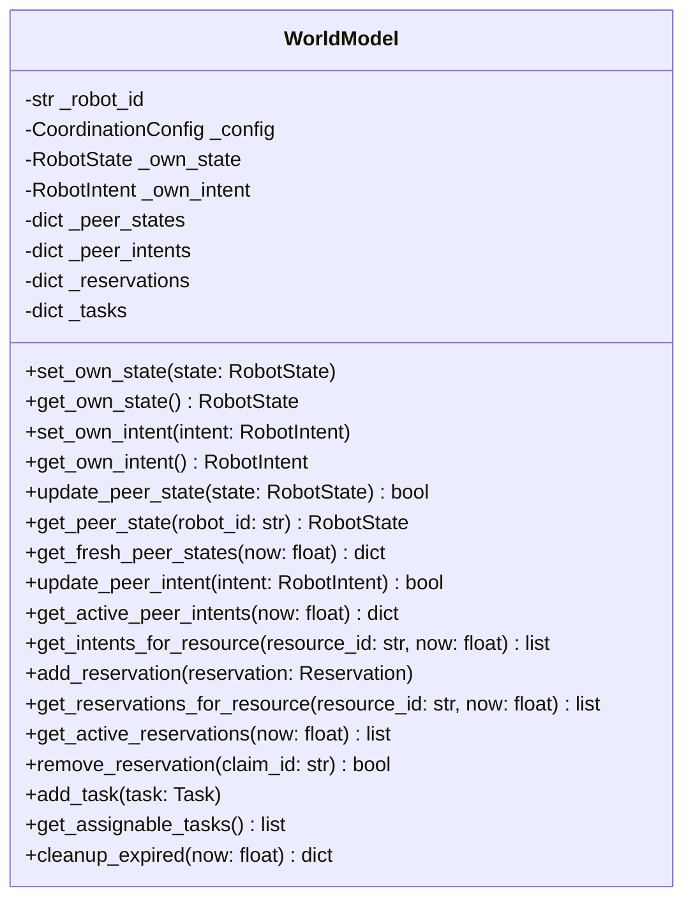
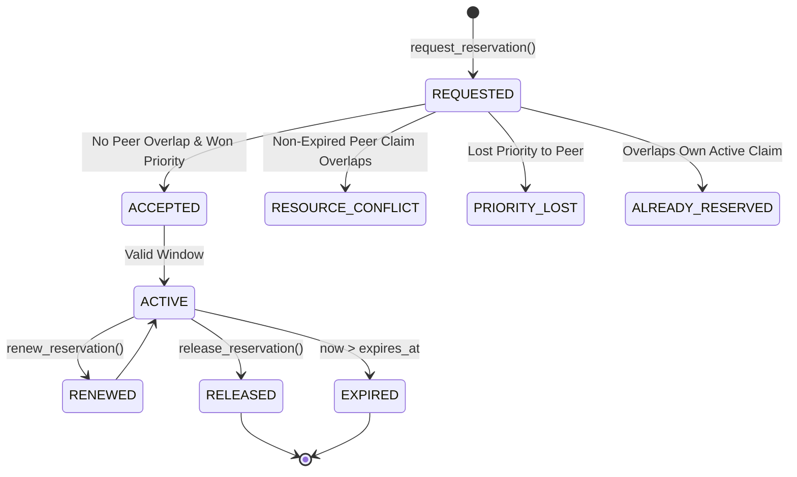
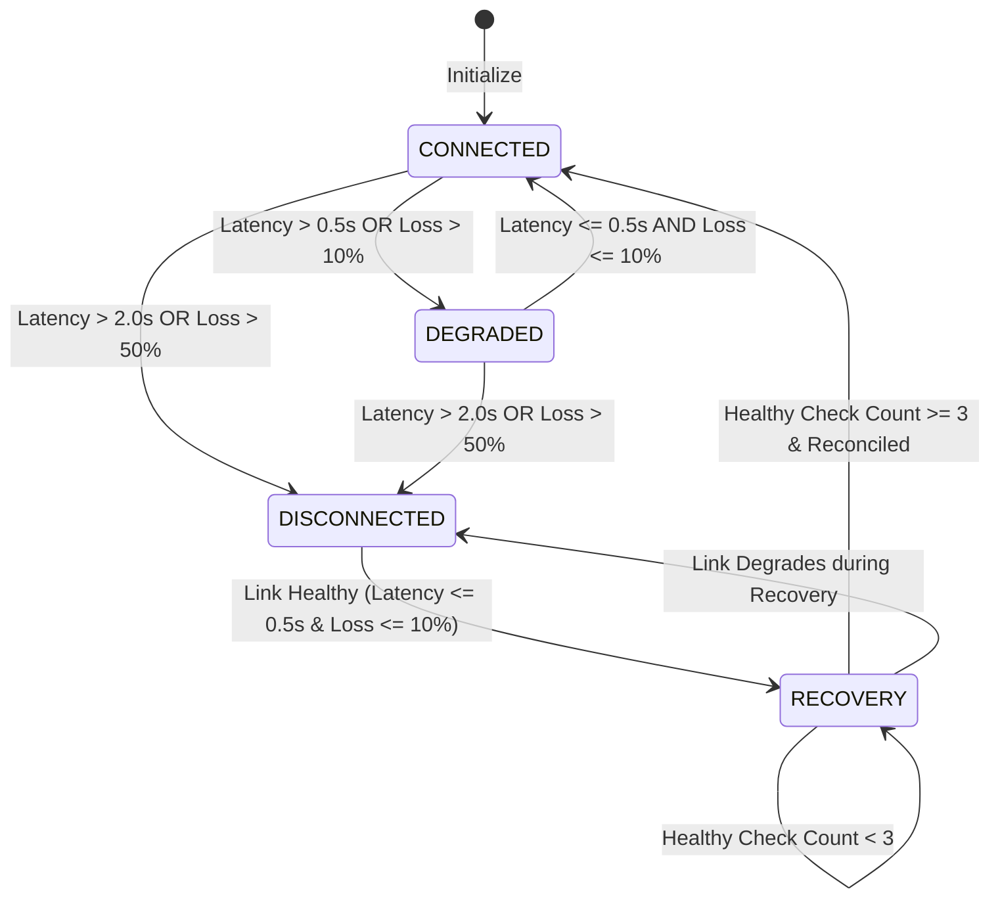
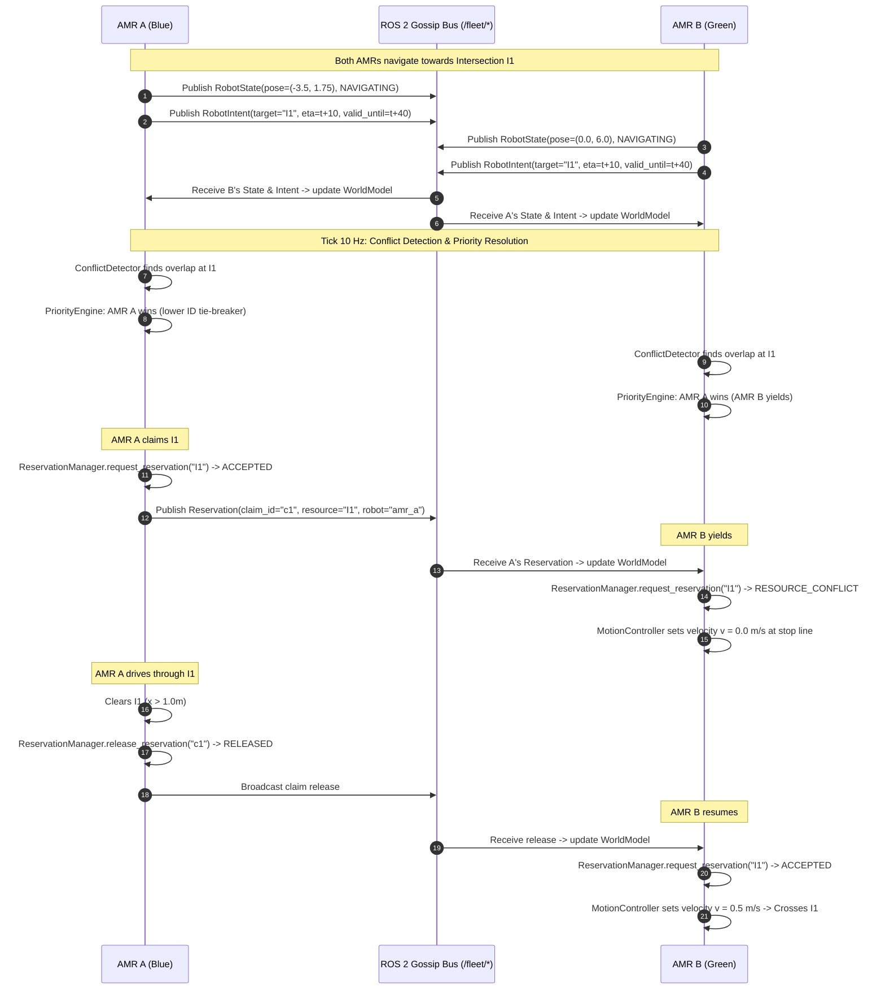

# SYNERGY — Fleet Coordination Subsystem Technical Documentation

> **Project Title:** Edge-AI Based Distributed Fleet Coordination for Autonomous Mobile Robots (AMRs) in Smart Warehouses  
> **Subsystem Location:** `fleet_coordination/`  
> **Primary Language:** Python (Pure Python Algorithmic Core + ROS 2 Interface Boundary)  
> **Test Coverage:** 323 Unit & Integration Tests (100% Passing)

---

## 1. Purpose of `fleet_coordination/`

The `fleet_coordination/` package contains the **distributed algorithmic decision-making engine** for multi-AMR warehouse operations. 

### Why This Subsystem Exists
In a smart warehouse, multiple Autonomous Mobile Robots (AMRs) transport payloads between pickup stations, drop packing zones, storage racks, and charging bays. Without multi-robot coordination, AMRs encounter deadlocks at narrow aisle intersections, block each other at shared stations, or bid redundantly on the same warehouse tasks.

### Core Architectural Principle
> **The algorithmic core must remain usable and testable without ROS 2, Gazebo, Nav2, or physical robot hardware.**

This strict architectural separation guarantees that:
1. **Algorithms are 100% testable in under 1 second** using pure Python test frameworks (`pytest`).
2. **Deterministic behavior can be formally verified** with fixed timestamps and zero networking jitter.
3. **No central single point of failure exists.** Every AMR runs an identical instance of the Fleet Coordination Agent, maintaining its own local state store (`WorldModel`) and reaching symmetric decisions independently.

### Responsibilities Boundary

```
┌────────────────────────────────────────────────────────────────────────────┐
│                  RESPONSIBILITY BOUNDARY MATRIX                            │
├──────────────────────────────────────┬─────────────────────────────────────┤
│   BELONGS INSIDE fleet_coordination/ │ DOES NOT BELONG HERE                │
├──────────────────────────────────────┼─────────────────────────────────────┤
│ • Local state & intent tracking      │ • Motor control & PID loops         │
│ • Spatial/temporal conflict detect   │ • LiDAR SLAM & Localization (AMCL)  │
│ • Multi-factor priority arbitration  │ • Trajectory generation / DWB local │
│ • Shared resource reservation logic  │ • Costmap inflation & voxel updates │
│ • Distributed task auctioning & bids │ • 3D Physics & mesh rendering (GZ)  │
│ • JSON serialization for gossip      │ • Centralized fleet dashboards      │
└──────────────────────────────────────┴─────────────────────────────────────┘
```

---

## 2. High-Level Architecture

### Algorithmic Pipeline & ROS 2 Boundary



---

## 3. Folder Structure

The directory tree reflects the hard architectural boundary between algorithms and middleware:

```
fleet_coordination/
│
├── config/
│   ├── __init__.py
│   └── coordination_config.py      # Tunable weights, timeouts, thresholds (single source of truth)
│
├── models/                         # Pure dataclasses & domain vocabulary (ZERO business logic)
│   ├── __init__.py
│   ├── pose.py                     # Pose2D (immutable x, y, theta)
│   ├── robot_state.py              # RobotState, RobotStatus enum
│   ├── robot_intent.py             # RobotIntent (resource claims, ETAs, waypoints)
│   ├── reservation.py              # Reservation (claim_id, time interval, hard expiry)
│   ├── task.py                     # Task, TaskType enum, TaskStatus enum
│   ├── conflict.py                 # ConflictReport, ConflictSeverity enum
│   ├── priority_decision.py        # PriorityDecision (scores, factors, tie-break flag)
│   ├── reservation_decision.py     # ReservationDecision (reason codes, claim_id)
│   ├── task_bid.py                 # TaskBid (bid scores, factor breakdown)
│   └── assignment_decision.py      # AssignmentDecision (winner_id, bids, status)
│
├── algorithm/                      # Pure Python decision engines (ZERO ROS imports)
│   ├── __init__.py
│   ├── world_model.py              # Local private state store & query engine
│   ├── conflict_detector.py        # Spatial & temporal overlap detector
│   ├── priority_engine.py          # Multi-factor priority arbitrator
│   ├── reservation_manager.py      # Resource reservation lifecycle service
│   └── task_allocator.py           # Distributed bidding & task assigner
│
├── ros_interface/                  # ROS 2 adapter boundary (ONLY place with ROS dependencies)
│   ├── __init__.py
│   ├── serialization.py            # Dataclass <-> JSON serializer/deserializer
│   └── fleet_node.py               # FleetCoordinationNode (rclpy) & FleetCoordinationCore
│
└── tests/                          # Automated pytest suite (249 passing tests)
    ├── __init__.py
    ├── conftest.py                 # Shared fixtures & deterministic factories
    ├── test_models.py              # Model construction, immutability & method tests
    ├── test_world_model.py         # Isolation, monotonic updates, expiry & GC tests
    ├── test_conflict_detector.py   # Option C occupancy, intervals, severity tests
    ├── test_priority_engine.py     # Normalized scoring, epsilon & tie-break tests
    ├── test_reservation_manager.py # Invariants INV-1 to INV-8, renewal & release tests
    ├── test_task_allocator.py      # Eligibility, multi-robot bids & assignment tests
    ├── test_serialization.py       # JSON roundtrip, schema validation & error tests
    └── test_fleet_node.py          # Odometry conversion, self-filter & peer mesh tests
```

---

## 4. Core Design Principles

1. **Decentralized Decision-Making:** There is no central dispatcher or fleet master. Every AMR independently runs the coordination stack.
2. **Local Working Memory (`WorldModel`):** Each robot maintains its own internal view of itself and its peers. Telemetry is updated via peer broadcasts.
3. **Deterministic Agreement:** Given symmetric WorldModel inputs and an explicit reference timestamp `now`, every robot running `PriorityEngine` or `TaskAllocator` computes the exact same winner.
4. **Monotonic Timestamp Ordering:** Telemetry updates with timestamps $\le$ stored timestamps are rejected. This prevents network delays or out-of-order packet delivery from corrupting state memory.
5. **Query-Time Freshness & Expiry:** Query methods dynamically filter expired records based on `now`. Correctness does not depend on garbage collection sweeps.
6. **Local Single-View Mutual Exclusion (INV-1):** Within a single WorldModel view, `ReservationManager` never grants overlapping intervals on the same resource to different robots.
7. **Non-Preemption (INV-8):** An active, granted reservation is never revoked or preempted by a competing request, regardless of priority.
8. **Idempotency (INV-4, INV-ALREADY):** Releasing an already-released claim returns `accepted=True, reason="ALREADY_RELEASED"`. Requesting an overlapping window on an already-held reservation returns `accepted=True, reason="ALREADY_RESERVED"`.
9. **Epsilon Floating-Point Tie-Breaking (INV-3):** Floating-point scores within $\epsilon = 10^{-9}$ are treated as ties and resolved via deterministic lexicographic string comparison (`robot_id`).
10. **Zero External Dependencies in Core:** The algorithmic core relies exclusively on the Python standard library (`math`, `time`, `uuid`, `dataclasses`, `enum`, `typing`).

---

## 5. Domain Models

All domain models reside in `fleet_coordination/models/` and are defined as typed dataclasses.

### 5.1 Pose2D (`models/pose.py`)
Immutable 2D position and orientation on the warehouse floor.
- **Fields:**
  - `x: float` (metres, required)
  - `y: float` (metres, required)
  - `theta: float = 0.0` (radians in $[-\pi, \pi]$, default `0.0`)
- **Key Method:** `distance_to(other: Pose2D) -> float` (Euclidean distance).

### 5.2 RobotState & RobotStatus (`models/robot_state.py`)
Snapshot of a robot's physical and operational telemetry.
- **`RobotStatus` Enum:** `IDLE`, `NAVIGATING`, `WAITING`, `CHARGING`, `FAILED`, `EMERGENCY_STOP`.
- **`RobotState` Fields:**
  - `robot_id: str` (required)
  - `timestamp: float` (Unix epoch seconds, default `time.time`)
  - `pose: Pose2D` (default `Pose2D(0.0, 0.0, 0.0)`)
  - `linear_velocity: float = 0.0` (m/s)
  - `angular_velocity: float = 0.0` (rad/s)
  - `battery_percent: float = 100.0` (0.0 to 100.0)
  - `current_task_id: str | None = None`
  - `status: RobotStatus = RobotStatus.IDLE`
- **Key Methods:**
  - `age(now: float | None = None) -> float`: Returns `now - timestamp`.
  - `is_available() -> bool`: Returns `True` if status is `IDLE` or `WAITING`.

### 5.3 RobotIntent (`models/robot_intent.py`)
Broadcast declaration of upcoming resource usage and planned waypoints.
- **Fields:**
  - `robot_id: str` (required)
  - `timestamp: float` (Unix epoch seconds, default `time.time`)
  - `task_id: str | None = None`
  - `target_resource_id: str | None = None` (e.g. `"I1"`, `"DOCK_A"`)
  - `eta: float | None = None` (expected arrival timestamp)
  - `priority: float = 0.0` (priority score)
  - `planned_waypoints: list[Pose2D] = field(default_factory=list)`
  - `valid_until: float = 0.0` (Hard expiry timestamp — mandatory for safety)
- **Key Methods:**
  - `is_expired(now: float | None = None) -> bool`: Returns `now > valid_until`.
  - `age(now: float | None = None) -> float`: Returns `now - timestamp`.

### 5.4 Reservation (`models/reservation.py`)
A temporary claim over a named shared resource.
- **Fields:**
  - `resource_id: str` (required)
  - `robot_id: str` (required)
  - `start_time: float` (Unix epoch seconds)
  - `end_time: float` (Unix epoch seconds)
  - `priority: float` (authoritative priority score)
  - `claim_id: str = field(default_factory=uuid4)`
  - `created_at: float = field(default_factory=time.time)`
  - `expires_at: float = 0.0` (Hard safety deadline)
- **Key Methods:**
  - `is_expired(now: float | None = None) -> bool`: Returns `now > expires_at`.
  - `is_active(now: float | None = None) -> bool`: Returns `not is_expired(now) and start_time <= now <= end_time`.
  - `overlaps_temporally(other: Reservation) -> bool`: Open-interval overlap test ($A_{\text{start}} < B_{\text{end}} \land B_{\text{start}} < A_{\text{end}}$).

### 5.5 Task, TaskType & TaskStatus (`models/task.py`)
Unit of warehouse logistics work.
- **`TaskType` Enum:** `PICKUP`, `DELIVERY`, `PICKUP_AND_DELIVERY`, `CHARGING`, `INSPECTION`.
- **`TaskStatus` Enum:** `ANNOUNCED`, `BIDDING`, `ASSIGNED`, `IN_PROGRESS`, `COMPLETED`, `FAILED`, `REASSIGNED`.
- **`Task` Fields:**
  - `task_id: str` (required)
  - `task_type: TaskType = TaskType.PICKUP_AND_DELIVERY`
  - `priority: int = 5` (Integer 1 to 10)
  - `deadline: float | None = None`
  - `payload_kg: float = 0.0`
  - `source_location: str = ""`
  - `target_location: str = ""`
  - `assigned_robot: str | None = None`
  - `status: TaskStatus = TaskStatus.ANNOUNCED`
  - `announced_at: float = field(default_factory=time.time)`
- **Key Methods:**
  - `is_assignable() -> bool`: Returns `True` if status in (`ANNOUNCED`, `BIDDING`, `FAILED`, `REASSIGNED`).
  - `deadline_urgency(now: float | None = None) -> float`: Returns $1.0 / \max(\text{deadline} - \text{now}, 1.0)$.

### 5.6 ConflictReport & ConflictSeverity (`models/conflict.py`)
Output of `ConflictDetector`.
- **`ConflictSeverity` Enum:** `LOW` ($>30\text{s}$), `MEDIUM` ($10\text{–}30\text{s}$), `HIGH` ($<10\text{s}$), `CRITICAL` ($\le 0\text{s}$).
- **`ConflictReport` Fields:**
  - `robot_a_id: str`, `robot_b_id: str`, `resource_id: str`
  - `overlap_start: float`, `overlap_end: float`
  - `severity: ConflictSeverity = ConflictSeverity.LOW`
  - `conflict_id: str = field(default_factory=uuid4)`
  - `detected_at: float = field(default_factory=time.time)`

### 5.7 PriorityDecision (`models/priority_decision.py`)
Output of `PriorityEngine`.
- **Fields:** `conflict_id: str`, `robot_a_id: str`, `robot_b_id: str`, `resource_id: str`, `score_a: float`, `score_b: float`, `factors_a: dict`, `factors_b: dict`, `winner_id: str`, `loser_id: str`, `tie_broken_by_id: bool`, `decided_at: float`.

### 5.8 ReservationDecision (`models/reservation_decision.py`)
Output of `ReservationManager`.
- **Fields:** `accepted: bool`, `robot_id: str`, `resource_id: str`, `start_time: float`, `end_time: float`, `claim_id: str | None`, `reason: str`, `conflicting_claim_id: str | None`, `reservation: Reservation | None`, `decided_at: float`.

### 5.9 TaskBid & AssignmentDecision (`models/task_bid.py`, `models/assignment_decision.py`)
Outputs of `TaskAllocator`.
- **`TaskBid` Fields:** `task_id: str`, `robot_id: str`, `bid_score: float`, `eligible: bool`, `factors: dict`, `ineligibility_reason: str | None`.
- **`AssignmentDecision` Fields:** `task_id: str`, `winner_id: str | None`, `winner_score: float`, `all_bids: dict[str, TaskBid]`, `accepted: bool`, `reason: str`, `tie_broken_by_id: bool`, `decided_at: float`.

### 5.10 PeerHealthAssessment & FleetHealthReport (`models/health.py`)
Outputs of `FailureDetector`.
- **`PeerHealthStatus` Enum:** `HEALTHY`, `SUSPECTED`, `FAILED`.
- **`PeerHealthAssessment` Fields:** `robot_id: str`, `status: PeerHealthStatus`, `last_seen_timestamp: float`, `age_seconds: float`, `reason: str`, `evaluated_at: float`.
- **`FleetHealthReport` Fields:** `assessments: dict[str, PeerHealthAssessment]`, `suspected_robot_ids: list[str]`, `failed_robot_ids: list[str]`, `evaluated_at: float`.

### 5.11 Obstacle & RerouteDecision (`models/obstacle.py`, `models/reroute_decision.py`)
Models for spatial blockages and reroute recommendations.
- **`Obstacle` Fields:** `obstacle_id: str`, `resource_id: str`, `detected_at: float`, `valid_until: float`, `location: Pose2D | None`, `is_active: bool`, `reporter_id: str`.
  - Methods: `is_expired(now) -> bool`, `is_blocking(now) -> bool`.
- **`RerouteDecision` Fields:** `robot_id: str`, `blocked_resource_id: str`, `reroute_required: bool`, `alternative_resource_id: str | None`, `suggested_waypoints: list[Pose2D]`, `reason: str`, `decided_at: float`.
  - Method: `is_reroute_available() -> bool`.

### 5.12 Network & Reconciliation Models (`models/network.py`, `models/reconciliation.py`)
Models for network telemetry, operational modes, and post-partition state recovery.
- **`NetworkMode` Enum:** `CONNECTED`, `DEGRADED`, `DISCONNECTED`, `RECOVERY`.
- **`LinkMetrics` Fields:** `peer_id: str`, `latency_seconds: float`, `packet_loss_rate: float`, `last_message_age_seconds: float`, `measured_at: float`.
- **`NetworkStatusReport` Fields:** `mode: NetworkMode`, `avg_latency_seconds: float`, `max_packet_loss_rate: float`, `link_reports: dict[str, LinkMetrics]`, `consecutive_healthy_checks: int`, `reason: str`, `evaluated_at: float`.
- **`ReconciliationReport` Fields:** `states_updated: int`, `intents_updated: int`, `conflicting_reservations_resolved: int`, `conflicting_tasks_resolved: int`, `stale_records_rejected: int`, `is_clean: bool`, `reconciled_at: float`.

---

## 6. Configuration System

All tunable parameters are centralized in `fleet_coordination/config/coordination_config.py`.

```
                        CoordinationConfig
                                │
   ┌──────────────┬─────────────┼──────────────┬──────────────┬─────────────┐
   ▼              ▼             ▼              ▼              ▼             ▼
Priority       TaskBid       Timeout        Network        Conflict      Obstacle
Weights        Weights       Config         Thresholds     Detection     Config
```

| Config Group | Parameter | Default | Purpose |
| :--- | :--- | :--- | :--- |
| **`PriorityWeights`** | `w_task` | `1.0` | Weight for normalized task priority |
| | `w_deadline` | `0.8` | Weight for deadline proximity urgency |
| | `w_wait` | `0.5` | Weight for intent commitment age |
| | `w_battery` | `0.3` | Weight for battery drain urgency |
| | `max_wait_seconds`| `120.0`| Normalization limit for waiting time |
| | `score_epsilon` | `1e-9` | Float tolerance before robot ID tie-break |
| **`TaskBidWeights`** | `w_battery` | `0.40`| Weight for robot battery level in task bidding |
| | `w_priority` | `0.35`| Weight for task priority in task bidding |
| | `w_deadline` | `0.25`| Weight for deadline urgency in task bidding |
| | `min_battery_percent` | `20.0` | Ineligibility threshold below 20% |
| **`TimeoutConfig`** | `peer_state_max_age_seconds` | `5.0` | Telemetry older than 5s is stale |
| | `peer_intent_max_age_seconds` | `10.0`| Intents older than 10s are stale |
| | `heartbeat_suspect_timeout_seconds` | `3.0` | Peer suspected after 3s silence |
| | `heartbeat_failure_timeout_seconds` | `10.0`| Peer declared failed after 10s silence |
| | `default_reservation_duration_seconds` | `30.0`| Fallback reservation window |
| **`ConflictDetectionConfig`** | `min_temporal_overlap_seconds` | `1.0` | Overlaps below 1s are ignored |
| | `planning_horizon_seconds` | `60.0`| Far-future conflicts ignored |
| **`CoordinationConfig`** | `lower_id_wins_ties` | `True` | Deterministic tie-breaker (`"amr_a"` < `"amr_b"`) |

---

## 7. `WorldModel` Subsystem

`WorldModel` (`fleet_coordination/algorithm/world_model.py`) is the **private working memory** of a single AMR.



### Key Behavioral Rules
1. **Own vs. Peer Isolation:** `_own_state` and `_own_intent` are isolated in private attributes and never mixed into peer tables.
2. **Monotonic Reject Policy:** In `update_peer_state` and `update_peer_intent`, incoming updates with `timestamp <= stored.timestamp` are rejected. Self-updates (`state.robot_id == self._robot_id`) return `False`.
3. **Query-Time Filtering:** `get_fresh_peer_states(now)` checks `state.age(now) <= peer_state_max_age_seconds`. `get_active_peer_intents(now)` checks `not intent.is_expired(now)`.
4. **Zero Decision Logic:** `WorldModel` stores and queries data only. It does not compute priorities or grant reservations.

---

## 8. `ConflictDetector` Subsystem

`ConflictDetector` (`fleet_coordination/algorithm/conflict_detector.py`) identifies spatial and temporal contention over named shared resources (e.g., Intersection `"I1"`).

### How It Works
1. Reads local robot's `own_intent`. If no intent or no `target_resource_id`, returns `[]`.
2. Derives expected occupancy window $[T_{\text{start}}, T_{\text{end}}]$ using **Option C Occupancy Modeling**:
   $$T_{\text{start}} = \max(\text{now}, \text{eta})$$
   $$T_{\text{end}} = \min(T_{\text{start}} + \Delta t_{\text{default}}, \text{valid\_until})$$
3. Compares `own_window` against all active peer intents targeting the same resource.
4. Compares `own_window` against all active peer reservations on that resource.
5. Checks open-interval overlap:
   $$\text{overlap} = (A_{\text{start}} < B_{\text{end}}) \land (B_{\text{start}} < A_{\text{end}})$$
6. If overlap duration $\ge \text{min\_temporal\_overlap\_seconds}$ (1.0s) and onset $\le \text{now} + \text{planning\_horizon\_seconds}$ (60s), creates a `ConflictReport`.
7. Aggregates multi-source evidence per `(peer_id, resource_id)` into a single bounding window and sorts deterministically by `(severity_rank, overlap_start, peer_id)`.

---

## 9. `PriorityEngine` Subsystem

`PriorityEngine` (`fleet_coordination/algorithm/priority_engine.py`) deterministically resolves conflicts between two AMRs.

### Normalized Multi-Factor Scoring Formula
For each contender $i \in \{A, B\}$, the composite priority score $S_i$ is:
$$S_i = w_{\text{task}} \cdot p_{\text{task}} + w_{\text{deadline}} \cdot p_{\text{deadline}} + w_{\text{wait}} \cdot p_{\text{wait}} + w_{\text{battery}} \cdot p_{\text{battery}}$$

Where normalized factors $\in [0.0, 1.0]$ are:
1. **Task Priority:** $p_{\text{task}} = \frac{\text{clamped\_priority} - 1}{9.0}$ (maps 1..10 to 0.0..1.0).
2. **Deadline Urgency:** $p_{\text{deadline}} = \frac{1}{\max(\text{deadline} - \text{now}, 1.0)}$.
3. **Waiting Time (Intent Commitment Age):** $p_{\text{wait}} = \min\left(\frac{\text{now} - \text{intent.timestamp}}{\text{max\_wait\_seconds}}, 1.0\right)$.
4. **Battery Urgency:** $p_{\text{battery}} = \frac{100.0 - \text{clamped\_battery}}{100.0}$.

### Deterministic Tie-Breaking
If $|S_A - S_B| \le \text{score\_epsilon}$ ($10^{-9}$), the winner is selected via lexicographic string comparison:
- `lower_id_wins_ties = True` $\implies \text{winner} = \min(\text{id}_A, \text{id}_B)$.

---

## 10. `ReservationManager` Subsystem

`ReservationManager` (`fleet_coordination/algorithm/reservation_manager.py`) manages the lifecycle of shared resource claims.

### Lifecycle State Machine



### Safety Invariants Enforced
- **INV-1 (Local Single-View Mutual Exclusion):** Rejects any request that overlaps a known non-expired peer reservation.
- **INV-2 (Ownership):** Only the owning robot can renew or release a reservation.
- **INV-4 (Idempotent Release):** Calling `release_reservation` on an unknown claim returns `accepted=True, reason="ALREADY_RELEASED"`.
- **INV-5 (Mutation Scope):** Only mutates `WorldModel._reservations`.
- **INV-8 (Non-Preemption):** An active, granted reservation is never preempted, even by higher-priority robots.

---

## 11. `TaskAllocator` Subsystem

`TaskAllocator` (`fleet_coordination/algorithm/task_allocator.py`) handles decentralized task evaluation and assignment.

### Public Methods
- **`evaluate_task(task, world_model, now) -> AssignmentDecision` (Read-Only):**
  - Gathers candidate robot states (own + fresh peer states).
  - Evaluates eligibility: telemetry age $\le 5.0\text{s}$, status in (`IDLE`, `WAITING`), no active task, battery $\ge 20\%$.
  - Calculates composite bid:
    $$\text{score} = \frac{w_{\text{batt}} \cdot f_{\text{batt}} + w_{\text{prio}} \cdot f_{\text{prio}} + w_{\text{dead}} \cdot f_{\text{dead}}}{w_{\text{batt}} + w_{\text{prio}} + w_{\text{dead}}}$$
  - Selects highest bidder; breaks ties within $\epsilon = 10^{-9}$ by `robot_id`.
- **`assign_task(task_id, world_model, decision) -> bool` (Explicit Mutation):**
  - Mutates only `task.status = TaskStatus.ASSIGNED` and `task.assigned_robot = decision.winner_id` in `WorldModel._tasks`.

---

## 12. `FailureDetector` Subsystem

`FailureDetector` (`fleet_coordination/algorithm/failure_detector.py`) is the stateless algorithmic service responsible for peer heartbeat health evaluation and task reclamation upon robot failure.

### Health Classification Rules
- **`HEALTHY`:** Heartbeat age $\le \text{heartbeat\_suspect\_timeout\_seconds}$ (3.0s).
- **`SUSPECTED`:** $3.0\text{s} < \text{age} \le \text{heartbeat\_failure\_timeout\_seconds}$ (10.0s).
- **`FAILED`:** Age $> 10.0\text{s}$, or peer broadcast status is `RobotStatus.FAILED` or `RobotStatus.EMERGENCY_STOP`.

### Public Methods
- **`evaluate_peer(peer_id, world_model, now) -> PeerHealthAssessment | None` (Read-Only):**
  - Evaluates heartbeat age and operational status of a single peer AMR.
- **`evaluate_fleet(world_model, now) -> FleetHealthReport` (Read-Only):**
  - Evaluates all peers in `world_model.get_all_peer_states()` and returns structured report with `suspected_robot_ids` and `failed_robot_ids`.
- **`reclaim_failed_robot_tasks(failed_robot_id, world_model, now) -> list[str]` (Explicit Mutation):**
  - Transitions active/in-progress tasks assigned to a failed AMR to `TaskStatus.FAILED`, making them assignable again for `TaskAllocator` to reassign.

---

## 13. `ObstaclePolicy` & `RerouteEvaluator` Subsystems

`ObstaclePolicy` (`fleet_coordination/algorithm/obstacle_policy.py`) and `RerouteEvaluator` (`fleet_coordination/algorithm/reroute_evaluator.py`) provide decision-only evaluation of spatial blockages (e.g., blocked aisles) and deterministic alternative corridor recommendations.

### Key Architectural Invariant
- **Decision-Only:** Neither `ObstaclePolicy` nor `RerouteEvaluator` mutates `WorldModel._tasks`, `_reservations`, or `_own_intent`.
- They produce a `RerouteDecision` that is returned to the outer coordination layer for interpretation.

### Public Methods
- **`ObstaclePolicy.is_resource_blocked(resource_id, world_model, now) -> bool`:** Checks if an active obstacle currently blocks the named resource.
- **`ObstaclePolicy.identify_affected_robots(world_model, now) -> dict[str, str]`:** Identifies all AMRs whose active intents target blocked resources.
- **`RerouteEvaluator.evaluate_reroute(robot_id, world_model, available_alternatives, now) -> RerouteDecision`:** Deterministically selects a clear alternative corridor from `available_alternatives`, filtering out any candidate that is also blocked.

---

## 14. `NetworkManager` & `ReconciliationManager` Subsystems

`NetworkManager` (`fleet_coordination/algorithm/network_manager.py`) tracks local communication health and manages transitions across operational modes (`CONNECTED`, `DEGRADED`, `DISCONNECTED`, `RECOVERY`). `ReconciliationManager` (`fleet_coordination/algorithm/reconciliation_manager.py`) executes deterministic state reconciliation across peer telemetry, intents, shared claims, and tasks upon reconnection.

### Network Mode Transition State Machine



### Deterministic State Reconciliation Precedence
1. **`RobotState`:** Monotonic timestamp ordering (older/equal timestamps rejected).
2. **`RobotIntent`:** Monotonic timestamp ordering + active validity window.
3. **`Reservation`:** Overlapping claims resolved by Priority $\rightarrow$ Earlier Created Timestamp $\rightarrow$ Lower Robot ID.
4. **`Task`:** Lifecycle hierarchy: `COMPLETED` > `IN_PROGRESS` > `ASSIGNED` > `BIDDING` > `ANNOUNCED`.

---

## 15. End-to-End Decision Flow



---

## 16. Decentralization Explained

```
CENTRALIZED (Anti-Pattern)                 DECENTRALIZED (SYNERGY Architecture)
      [Master Dispatcher]                       AMR A ◄────────► AMR B
       ▲      ▲      ▲                            ▲                ▲
       │      │      │                            └───────┬────────┘
     AMR A  AMR B  AMR C                                  ▼
(Single Point of Failure / Bottleneck)                  AMR C
                                          (No Central Master; Identical Determinism)
```

**Why a shared ROS 2 topic does NOT create centralization:**
- In ROS 2, topics (`/fleet/robot_state`, `/fleet/robot_intent`, `/fleet/obstacles`) use DDS multicast gossip.
- No central node aggregates or decides anything.
- Every node receives raw peer telemetry, updates its private memory, and independently runs the algorithmic pipeline.

---

## 17. ROS 2 Integration Boundary & Contract

### Implemented vs. Planned Status

| Component | Status | Implementation File | Description |
| :--- | :--- | :--- | :--- |
| **Serialization Bridge** | **IMPLEMENTED** | `ros_interface/serialization.py` | Full JSON $\leftrightarrow$ Dataclass conversion with schema validation. |
| **Fleet Node Core** | **IMPLEMENTED** | `ros_interface/fleet_node.py` | `FleetCoordinationCore` and `FleetCoordinationNode` (rclpy). |
| **Failure Detection** | **IMPLEMENTED** | `algorithm/failure_detector.py` | Heartbeat evaluator & task reclamation service. |
| **Obstacle & Rerouting Policy** | **IMPLEMENTED** | `algorithm/obstacle_policy.py`, `algorithm/reroute_evaluator.py` | Spatial blockage detection & deterministic route evaluation. |
| **Network & Reconciliation Engine** | **IMPLEMENTED** | `algorithm/network_manager.py`, `algorithm/reconciliation_manager.py` | Degradation mode manager & post-recovery state reconciliation. |
| **Metrics & Benchmarking** | **IMPLEMENTED** | `algorithm/metrics_logger.py`, `algorithm/benchmark_evaluator.py` | Performance measurement against sequential STOP-AND-WAIT baseline. |
| **Unit Tests** | **IMPLEMENTED** | `tests/` (13 test suites) | 323 tests validating algorithms, serialization, and node mesh. |
| **Gazebo Bridge Launch** | **PLANNED** | Integration script | Parameter bridge bridging `gz.msgs.OdometryWithCovariance` to `nav_msgs/msg/Odometry`. |
| **Motion Gateway** | **PLANNED** | `ros_interface/motion_controller.py` | Approach-line stop/resume velocity controller. |

### ROS 2 Connection Contract for Developers

```
INPUTS TO ALGORITHM:
  • Odometry / Pose: (pos_x, pos_y, yaw, linear_vel, angular_vel, timestamp)
  • Peer Messages: JSON strings over /fleet/robot_state, /fleet/robot_intent, /fleet/obstacles

OUTPUTS FROM ALGORITHM:
  • Local Broadcast: JSON string via serialization.to_json(obj)
  • Coordination Decision: PROCEED (v = 0.5 m/s) vs. WAIT (v = 0.0 m/s at stop line) vs. REROUTE
```

---

## 18. Testing Architecture

The entire codebase is validated by **323 automated tests** running in **< 1 second**.

```
============================= test session starts =============================
platform win32 -- Python 3.13.9, pytest-8.4.2
collected 323 items

fleet_coordination/tests/test_models.py .............................    [  8%] (29 tests)
fleet_coordination/tests/test_world_model.py ........................... [ 19%] (35 tests)
fleet_coordination/tests/test_conflict_detector.py ..................... [ 31%] (38 tests)
fleet_coordination/tests/test_priority_engine.py ....................... [ 43%] (37 tests)
fleet_coordination/tests/test_reservation_manager.py ................... [ 56%] (45 tests)
fleet_coordination/tests/test_task_allocator.py ........................ [ 68%] (36 tests)
fleet_coordination/tests/test_serialization.py ......................... [ 74%] (20 tests)
fleet_coordination/tests/test_fleet_node.py .........                    [ 77%] (9 tests)
fleet_coordination/tests/test_failure_detector.py ...................   [ 82%] (19 tests)
fleet_coordination/tests/test_obstacle_policy.py .....................  [ 89%] (21 tests)
fleet_coordination/tests/test_network_manager.py ...................... [ 96%] (22 tests)
fleet_coordination/tests/test_metrics.py .......                        [ 98%] (7 tests)
fleet_coordination/tests/test_benchmark.py .....                        [100%] (5 tests)

============================= 323 passed in 0.70s =============================
```

### Running Tests

```bash
# Run complete test suite
python -m pytest -q

# Run specific module tests
python -m pytest fleet_coordination/tests/test_network_manager.py -v
python -m pytest fleet_coordination/tests/test_obstacle_policy.py -v
```

---

## 19. Developer Rules for Extending the Codebase

1. **Strict Zero-ROS Rule in `algorithm/`:** Never import `rclpy`, `std_msgs`, or `geometry_msgs` inside `algorithm/` or `models/`.
2. **Never Bypass `WorldModel`:** All state reads and writes must pass through `WorldModel` accessors.
3. **Preserve Determinism:** Never call `time.time()` or `random()` inside algorithmic decision methods (`detect_conflicts`, `resolve`, `request_reservation`, `evaluate_task`, `evaluate_peer`, `evaluate_reroute`, `evaluate_network`). Always accept an explicit `now: float` argument.
4. **Mandatory Roundtrip Tests:** Any new domain dataclass added to `models/` must be registered in `serialization.py` with roundtrip tests in `test_serialization.py`.
5. **Always Run Regression:** Ensure all 323 tests pass before opening a PR.

---

## 20. Quick Developer Mental Model

When working on this codebase, keep these 9 mental anchors in mind:

1. **`WorldModel`** = *What this AMR currently knows* (own state + cached peer states + active obstacles).
2. **`RobotIntent`** = *What this AMR plans to do in the near future*.
3. **`ConflictDetector`** = *Will our planned trajectories/resources collide?*
4. **`PriorityEngine`** = *Who has priority right now?*
5. **`ReservationManager`** = *Who authoritatively holds the shared resource claim?*
6. **`TaskAllocator`** = *Which AMR should execute this warehouse task?*
7. **`FailureDetector`** = *Is any peer AMR unresponsive or failed?*
8. **`ObstaclePolicy & RerouteEvaluator`** = *Is our planned corridor blocked, and what is the best alternative route?*
9. **`NetworkManager & ReconciliationManager`** = *What is our communication health, and how do we resolve split-brain state after reconnecting?*

---

## 21. Metrics & Benchmark Evaluation

Phase 7.6 introduces a pure-Python, deterministic metrics and benchmarking subsystem to evaluate the SYNERGY algorithm against a baseline STOP-AND-WAIT model.

### Models (`models/metrics.py`)
- **TaskMetrics**: Tracks `announced_at`, `completed_at`, and `completion_time_seconds`.
- **RobotMetrics**: Tracks cumulative `WAITING` time, `tasks_completed`, and `collision_count`.
- **PerformanceMetrics**: Aggregates throughput, average completion time, average waiting time, collisions, and recovery events.

### MetricsLogger (`algorithm/metrics_logger.py`)
- A deterministic, stateless event historian.
- Accurately tracks WAITING -> NAVIGATING transitions and task lifecycles.
- Employs explicit `now: float` timestamps, never `time.time()`.

### BenchmarkEvaluator (`algorithm/benchmark_evaluator.py`)
- Executes scenarios against a synthetic clock (`dt = 0.1s`).
- Definitively measures `Average Task Completion Time (ATCT)` improvement.
- **Success Criterion**: `>= 20.0%` ATCT improvement AND exactly `0` collisions.
- A deadlocked baseline yields a `100.0%` improvement if the decentralized model successfully completes the task.
