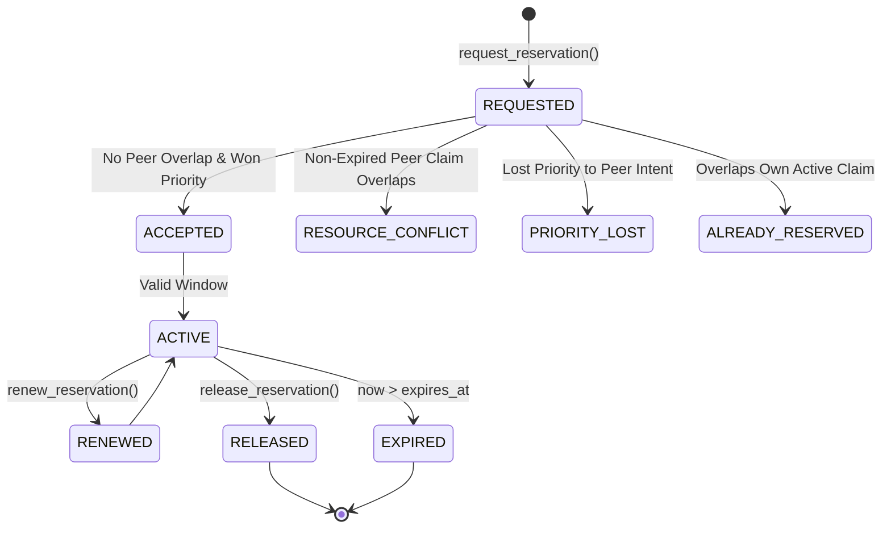
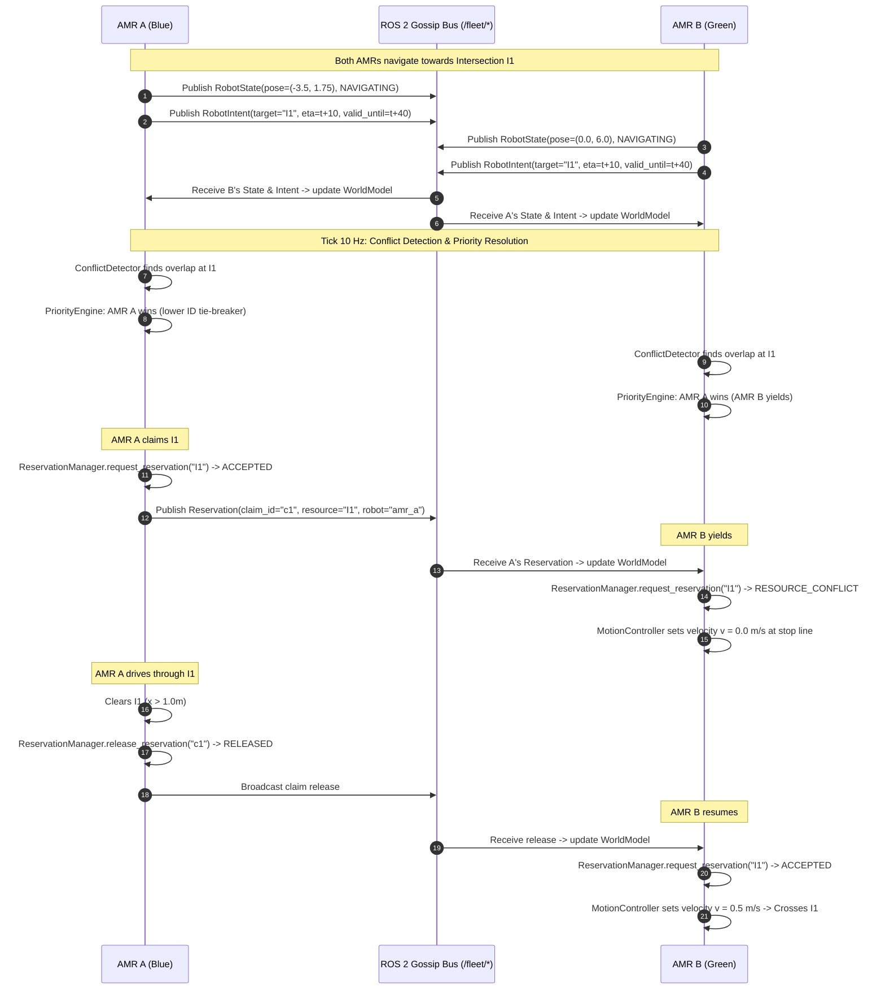

# SYNERGY — Decentralized Multi-AMR Warehouse Fleet Coordination & Operations Platform

> **Edge-AI Based Distributed Fleet Coordination, High-Fidelity Physics Simulation & Live Industrial Operations Command Center for Autonomous Mobile Robots (AMRs)**

[](https://www.python.org/downloads/)
[](https://docs.ros.org/)
[-blueviolet.svg)](https://gazebosim.org/)
[]()
[]()

SYNERGY is an industrial-grade, competition-ready multi-robot logistics coordination platform. It combines a pure-Python, mathematically verified decentralized coordination algorithm with a high-fidelity Gazebo Sim physics environment, ROS 2 integration nodes, custom message schemas, and a dedicated 60 FPS industrial operations dashboard.

---

## 📑 Table of Contents

1. [System Overview & Key Features](#-system-overview--key-features)
2. [Repository Architecture & File Map](#-repository-architecture--file-map)
3. [Core Principles & Responsibility Boundary Matrix](#-core-principles--responsibility-boundary-matrix)
4. [High-Level System Architecture](#-high-level-system-architecture)
5. [Fleet Coordination Algorithmic Subsystem (`fleet_coordination/`)](#-fleet-coordination-algorithmic-subsystem-fleet_coordination)
   - [Domain Data Models](#51-domain-data-models)
   - [Configuration System](#52-configuration-system)
   - [WorldModel (Local Private State Store)](#53-worldmodel-local-private-state-store)
   - [ConflictDetector (Spatial & Temporal Contention)](#54-conflictdetector-spatial--temporal-contention)
   - [PriorityEngine (Deterministic Multi-Factor Arbitration)](#55-priorityengine-deterministic-multi-factor-arbitration)
   - [ReservationManager (Mutual Exclusion Lifecycle)](#56-reservationmanager-mutual-exclusion-lifecycle)
   - [TaskAllocator (Distributed Auction & Eligibility)](#57-taskallocator-distributed-auction--eligibility)
   - [FailureDetector (Heartbeat & Task Reclamation)](#58-failuredetector-heartbeat--task-reclamation)
   - [ObstaclePolicy & RerouteEvaluator](#59-obstaclepolicy--rerouteevaluator)
   - [NetworkManager & ReconciliationManager](#510-networkmanager--reconciliationmanager)
   - [MetricsLogger & BenchmarkEvaluator](#511-metricslogger--benchmarkevaluator)
6. [End-to-End Decision Flow](#-end-to-end-decision-flow)
7. [Decentralization vs. Centralized Anti-Patterns](#-decentralization-vs-centralized-anti-patterns)
8. [ROS 2 Middleware & Custom Interfaces (`src/`)](#-ros-2-middleware--custom-interfaces-src)
   - [Custom Message Schemas (`fleet_msgs`)](#81-custom-message-schemas-fleet_msgs)
   - [ROS 2 Nodes & Packages Catalog](#82-ros-2-nodes--packages-catalog)
   - [Middleware Bridge Contract](#83-middleware-bridge-contract)
9. [Live AMR Operations Command Center (`dashboard/`)](#-live-amr-operations-command-center-dashboard)
   - [Architectural 20×20m Warehouse Map & Canvas Engine](#91-architectural-2020m-warehouse-map--canvas-engine)
   - [Running the Dashboard (Mock & ROS 2 Modes)](#92-running-the-dashboard-mock--ros-2-modes)
   - [REST API Endpoints](#93-rest-api-endpoints)
10. [High-Fidelity Physics Simulation (`gazebo/`)](#-high-fidelity-physics-simulation-gazebo)
    - [Warehouse World Layout & Chokepoint Coordinates](#101-warehouse-world-layout--chokepoint-coordinates)
    - [Active AMR Fleet Specifications](#102-active-amr-fleet-specifications)
    - [Universal Simulation Launchers](#103-universal-simulation-launchers)
11. [Distributed Task Failure & Recovery Subsystem (`p5_task_failure/`)](#-distributed-task-failure--recovery-subsystem-p5_task_failure)
12. [Installation, Setup & Quick Start](#-installation-setup--quick-start)
13. [Test Suite Execution](#-test-suite-execution)
14. [Developer Guidelines & Mental Anchors](#-developer-guidelines--mental-anchors)

---

## 🌟 System Overview & Key Features

Modern automated warehouses experience severe throughput bottlenecks when autonomous vehicles contest narrow aisle intersections, block shared pickup/dropoff stations, or duplicate assignments during communication drops. 

**SYNERGY solves this through edge-intelligent, decentralized peer coordination:**
- **Zero Single Point of Failure:** No central dispatch server. Each AMR runs an autonomous decision-making core and evaluates global state locally.
- **Strict Decoupling:** Algorithmic logic has **zero dependencies on ROS 2, Gazebo, or physics engines**, executing hundreds of deterministic tests in $<1.0\text{ s}$.
- **Mathematical Determinism:** Given symmetric world views and an explicit reference timestamp $t$, peer AMRs calculate the exact same winner with $10^{-9}$ floating-point tie-break precision.
- **Dynamic Chokepoint Arbitration:** Spatio-temporal reservation intervals for narrow aisles and intersection zones ($I1$, $I2$) prevent physical deadlocks.
- **Fault-Tolerant Mesh Protocol:** Heartbeat health monitoring, automated task reclamation, dynamic obstacle rerouting, and split-brain reconciliation upon network reconnection.
- **Multi-Platform Ready:** Native support and launchers for macOS (Apple Silicon & Intel), Ubuntu Linux, and Windows (WSL2 & Native).

---

## 📁 Repository Architecture & File Map

```
amr_project/
├── dashboard/                      # Live Industrial AMR Fleet Operations Dashboard
│   ├── app.py                      # Flask REST API backend & static server
│   ├── config.py                   # 20m × 20m warehouse coordinates & configuration
│   ├── data_store.py               # In-memory thread-safe telemetry store
│   ├── event_logger.py             # Event streaming & audit logging
│   ├── metrics.py                  # Real-time dashboard KPI & benchmark aggregation
│   ├── models.py                   # Typed dashboard data models
│   ├── run_dashboard.py            # Universal CLI entrypoint (Mock vs. ROS 2)
│   ├── simulator/                  # Standalone mock telemetry engine (6 scenarios)
│   ├── static/                     # Light industrial theme CSS & 60 FPS Canvas 2D engine
│   ├── templates/                  # Operations command center HTML template
│   └── tests/                      # 79 pytest unit & integration tests
├── fleet_coordination/             # Pure-Python Algorithmic Decision Engine
│   ├── config/                     # Single source of truth for weights, timeouts, thresholds
│   │   └── coordination_config.py
│   ├── models/                     # Pure dataclasses (domain vocabulary, zero logic)
│   │   ├── assignment_decision.py  # Winner IDs, bids, allocation status
│   │   ├── conflict.py             # ConflictReport, ConflictSeverity enum
│   │   ├── health.py               # PeerHealthAssessment, FleetHealthReport
│   │   ├── metrics.py              # TaskMetrics, RobotMetrics, PerformanceMetrics
│   │   ├── network.py              # LinkMetrics, NetworkStatusReport, NetworkMode
│   │   ├── obstacle.py             # Obstacle domain model
│   │   ├── pose.py                 # Pose2D (immutable x, y, theta)
│   │   ├── priority_decision.py    # PriorityDecision, score breakdowns
│   │   ├── reconciliation.py       # ReconciliationReport (split-brain resolution)
│   │   ├── reroute_decision.py     # RerouteDecision, suggested waypoints
│   │   ├── reservation.py          # Reservation, temporal intervals
│   │   ├── reservation_decision.py # ReservationDecision, reason codes
│   │   ├── robot_intent.py         # RobotIntent (claims, ETAs, waypoints)
│   │   ├── robot_state.py          # RobotState, RobotStatus enum
│   │   ├── task.py                 # Task, TaskType, TaskStatus enum
│   │   └── task_bid.py             # TaskBid, factor breakdowns
│   ├── algorithm/                  # Core algorithmic decision engines (ZERO ROS imports)
│   │   ├── benchmark_evaluator.py  # Synthetic benchmark against STOP-AND-WAIT baseline
│   │   ├── conflict_detector.py    # Spatial & temporal overlap detector
│   │   ├── failure_detector.py     # Heartbeat-based peer health & task reclamation
│   │   ├── metrics_logger.py       # Observational event historian & state counter
│   │   ├── network_manager.py      # Communication quality tracker (4 modes)
│   │   ├── obstacle_policy.py      # Spatial blockage detection & affected robot query
│   │   ├── priority_engine.py      # Multi-factor priority arbitrator
│   │   ├── reconciliation_manager.py # Post-partition state convergence engine
│   │   ├── reroute_evaluator.py    # Deterministic alternative route evaluator
│   │   ├── reservation_manager.py  # Resource mutual-exclusion lifecycle service
│   │   ├── task_allocator.py       # Distributed auction & bidding engine
│   │   └── world_model.py          # Local private state store & query engine
│   ├── ros_interface/              # ROS 2 adapter boundary (Node & Serialization)
│   │   ├── fleet_node.py           # FleetCoordinationNode (rclpy) & FleetCoordinationCore
│   │   └── serialization.py        # Dataclass <-> JSON serializer/deserializer
│   └── tests/                      # 13 test suites (323 pytest unit & integration tests)
├── gazebo/                         # Gazebo Sim 3D Environment & Models
│   ├── scripts/                    # Universal cross-platform simulation launchers (.sh, .py, .bat, .ps1)
│   └── simulation/
│       ├── models/                 # Modular SDF models (AMRs, Shelves, Pallets, Stations)
│       └── worlds/
│           ├── warehouse.sdf       # Master 20m × 20m multi-robot warehouse world
│           └── amr_test.sdf        # Isolated single-robot test environment
├── p5_task_failure/                # Standalone Task Allocation & Failure Recovery MVP
│   ├── p5/                         # Pure-Python task allocation, failure & recovery stubs
│   ├── simulation/                 # Standalone terminal simulation demo
│   └── tests/                      # Pytest unit tests for P5
├── src/                            # ROS 2 Workspace Packages
│   ├── dashboard_bridge/           # ROS 2 to Operations Dashboard bridge node
│   ├── fleet_coordination/         # Colcon package wrapper for fleet coordination
│   ├── fleet_msgs/                 # Custom ROS 2 msg definitions (Heartbeat, Intent, etc.)
│   ├── robot_bringup/              # Launch files for multi-AMR Gazebo simulation
│   ├── synergy_nav2/               # Nav2 navigation stack configuration & maps
│   └── task_allocator/             # Task allocator ROS 2 node
├── run_task_allocators.sh          # Multi-allocator shell launch script
├── Dockerfile                      # Containerized deployment definition
└── README.md                       # Master comprehensive repository documentation
```

---

## 🎯 Core Principles & Responsibility Boundary Matrix

### Architectural Principles
1. **Zero External Simulation Dependencies in Core:** The algorithmic core relies exclusively on the Python standard library (`math`, `time`, `uuid`, `dataclasses`, `enum`, `typing`).
2. **Deterministic Agreement:** Given identical WorldModel inputs and an explicit reference timestamp `now`, every robot running `PriorityEngine` or `TaskAllocator` computes the exact same result.
3. **Monotonic Ordering:** Telemetry updates with timestamps $\le$ stored timestamps are rejected to prevent out-of-order networking corruption.
4. **Non-Preemption (INV-8):** An active, granted reservation is never revoked or preempted by a competing request, regardless of priority.
5. **Local Single-View Mutual Exclusion (INV-1):** Within a single WorldModel view, overlapping intervals for the same resource are never granted to different AMRs.

### Responsibility Boundary Matrix

```
┌────────────────────────────────────────────────────────────────────────────┐
│                  RESPONSIBILITY BOUNDARY MATRIX                            │
├──────────────────────────────────────┬─────────────────────────────────────┤
│   BELONGS INSIDE fleet_coordination/ │ DOES NOT BELONG HERE                │
├──────────────────────────────────────┼─────────────────────────────────────┤
│ • Local state & intent tracking      │ • Motor control & PID loops         │
│ • Spatial/temporal conflict detect   │ • LiDAR SLAM & Localization (AMCL)  │
│ • Multi-factor priority arbitration  │ • Trajectory generation / DWB local │
│ • Shared resource reservation logic  │ • Costmap inflation & voxel updates │
│ • Distributed task auctioning & bids │ • 3D Physics & mesh rendering (GZ)  │
│ • Heartbeat failure & task reclaim   │ • Hardware-level wireless drivers   │
│ • Dynamic obstacle rerouting advice  │ • Centralized server dispatchers    │
│ • Post-partition state recovery      │ • Direct web UI rendering           │
│ • JSON serialization for gossip      │ • Physical battery charge hardware  │
└──────────────────────────────────────┴─────────────────────────────────────┘
```

---

## 🏗️ High-Level System Architecture

```mermaid
flowchart TD
    subgraph Simulation_Hardware ["Simulation & Actuation Layer (Gazebo / Hardware)"]
        GZ["Gazebo Sim (Harmonic)"]
        NAV["Nav2 Navigation Stack"]
    end

    subgraph ROS_Boundary ["ROS 2 Interface Layer (src/ & ros_interface/)"]
        BRIDGE["ros_gz_bridge (Parameter Bridge)"]
        NODE["FleetCoordinationNode (rclpy)"]
        SERIAL["Serialization Bridge (serialization.py)"]
        DASH_BRIDGE["DashboardBridgeNode"]
    end

    subgraph Algorithmic_Core ["Algorithmic Core (fleet_coordination/algorithm/ - ZERO ROS Dependencies)"]
        WM["WorldModel (Local Private State Store)"]
        CD["ConflictDetector (Spatial-Temporal Evaluator)"]
        PE["PriorityEngine (Deterministic Arbitration)"]
        RM["ReservationManager (Lifecycle Mutual Exclusion)"]
        TA["TaskAllocator (Distributed Auction Engine)"]
        FD["FailureDetector (Health & Recovery)"]
        OP["ObstaclePolicy & RerouteEvaluator"]
        NM["NetworkManager & ReconciliationManager"]
        METRICS["MetricsLogger & BenchmarkEvaluator"]
    end

    subgraph Dashboard_Layer ["Operations Dashboard (dashboard/)"]
        DASH_APP["Flask REST & Telemetry Server"]
        DUI["2D Floor Plan Canvas Engine (60 FPS)"]
    end

    %% Telemetry Flow
    GZ -->|/amr_x/odom| BRIDGE
    BRIDGE -->|nav_msgs/msg/Odometry| NODE
    NODE -->|odometry_to_robot_state| WM

    %% Gossip Network Flow
    NODE -->|to_json RobotState / RobotIntent| SERIAL
    SERIAL -->|std_msgs/msg/String| ROS_GOSSIP["/fleet/robot_state, /fleet/robot_intent, /fleet/obstacles"]
    ROS_GOSSIP -->|from_json| NODE
    NODE -->|update_peer_state / update_peer_intent| WM

    %% Algorithmic Pipeline Flow
    WM --> CD
    CD -->|ConflictReport| PE
    WM --> PE
    PE -->|PriorityDecision| RM
    WM <-->|Mutate _reservations only| RM
    WM <-->|evaluate_task / assign_task| TA
    WM --> FD
    WM --> OP
    WM --> NM
    WM --> METRICS

    %% Motion Action Flow
    RM -->|ReservationDecision: ACCEPTED / YIELD| NODE
    NODE -.->|Velocity Gate: PROCEED (0.5m/s) / WAIT (0.0m/s)| NAV
    NAV -.->|/amr_x/cmd_vel| GZ

    %% Dashboard Bridge Flow
    ROS_GOSSIP --> DASH_BRIDGE
    DASH_BRIDGE -->|HTTP / REST Telemetry| DASH_APP
    DASH_APP --> DUI
```

---

## 🧠 Fleet Coordination Algorithmic Subsystem (`fleet_coordination/`)

### 5.1 Domain Data Models

All domain models reside in `fleet_coordination/models/` and are defined as immutable or type-annotated dataclasses:

| Model | Source File | Description & Key Attributes |
| :--- | :--- | :--- |
| **`Pose2D`** | `models/pose.py` | Immutable 2D pose `(x, y, theta)`. Implements `distance_to(other: Pose2D) -> float`. |
| **`RobotState`** | `models/robot_state.py` | Physical snapshot: `robot_id`, `timestamp`, `pose`, `linear_velocity`, `angular_velocity`, `battery_percent`, `status` (`IDLE`, `NAVIGATING`, `WAITING`, `CHARGING`, `FAILED`, `EMERGENCY_STOP`). |
| **`RobotIntent`** | `models/robot_intent.py` | Broadcast declaration: `target_resource_id`, `eta`, `priority`, `planned_waypoints`, `valid_until` (hard safety deadline). |
| **`Reservation`** | `models/reservation.py` | Authoritative resource claim: `resource_id`, `robot_id`, `start_time`, `end_time`, `priority`, `claim_id`, `expires_at`. Checks `overlaps_temporally()`. |
| **`Task`** | `models/task.py` | Logistics work: `task_id`, `task_type` (`PICKUP_AND_DELIVERY`, etc.), `priority` (1–10), `deadline`, `payload_kg`, `assigned_robot`, `status`. Calculates `deadline_urgency()`. |
| **`ConflictReport`** | `models/conflict.py` | Contention output: `robot_a_id`, `robot_b_id`, `resource_id`, `overlap_start`, `overlap_end`, `severity` (`LOW`, `MEDIUM`, `HIGH`, `CRITICAL`). |
| **`PriorityDecision`** | `models/priority_decision.py` | Arbitration output: `winner_id`, `loser_id`, `score_a`, `score_b`, `factors_a`, `factors_b`, `tie_broken_by_id`. |
| **`ReservationDecision`**| `models/reservation_decision.py`| Lease output: `accepted`, `reason` (`ACCEPTED`, `RESOURCE_CONFLICT`, `PRIORITY_LOST`, `ALREADY_RESERVED`, `ALREADY_RELEASED`), `claim_id`. |
| **`TaskBid` & `AssignmentDecision`** | `models/task_bid.py`, `models/assignment_decision.py` | Bidding output: `bid_score`, `eligible`, `ineligibility_reason`, `winner_id`, `winner_score`, `all_bids`. |
| **`PeerHealthAssessment` & `FleetHealthReport`** | `models/health.py` | Heartbeat health: `status` (`HEALTHY`, `SUSPECTED`, `FAILED`), `last_seen_timestamp`, `suspected_robot_ids`, `failed_robot_ids`. |
| **`Obstacle` & `RerouteDecision`** | `models/obstacle.py`, `models/reroute_decision.py` | Corridor blockages: `resource_id`, `valid_until`, `reroute_required`, `alternative_resource_id`, `suggested_waypoints`. |
| **`LinkMetrics` & `NetworkStatusReport`** | `models/network.py` | Communication quality: `mode` (`CONNECTED`, `DEGRADED`, `DISCONNECTED`, `RECOVERY`), `avg_latency_seconds`, `max_packet_loss_rate`. |
| **`ReconciliationReport`** | `models/reconciliation.py` | Post-partition state convergence statistics: `states_updated`, `conflicts_resolved`, `stale_rejected`, `is_clean`. |
| **`PerformanceMetrics`** | `models/metrics.py` | Quantitative metrics: `throughput_tasks_per_hour`, `average_completion_time_seconds`, `average_waiting_time_seconds`, `collision_count`. |

---

### 5.2 Configuration System

All tunable weights, thresholds, and timeouts are centralized in `fleet_coordination/config/coordination_config.py`:

```
                        CoordinationConfig
                                │
   ┌──────────────┬─────────────┼──────────────┬──────────────┬─────────────┐
   ▼              ▼             ▼              ▼              ▼             ▼
Priority       TaskBid       Timeout        Network        Conflict      Obstacle
Weights        Weights       Config         Thresholds     Detection     Config
```

| Config Parameter | Default Value | Algorithmic Purpose |
| :--- | :--- | :--- |
| `PriorityWeights.w_task` | `1.0` | Weight for normalized task priority ($1\dots10 \rightarrow 0.0\dots1.0$) |
| `PriorityWeights.w_deadline` | `0.8` | Weight for deadline proximity urgency |
| `PriorityWeights.w_wait` | `0.5` | Weight for intent commitment age (prevents starvation) |
| `PriorityWeights.w_battery` | `0.3` | Weight for battery drain urgency |
| `PriorityWeights.max_wait_seconds` | `120.0` | Upper limit for wait-time normalization |
| `PriorityWeights.score_epsilon` | `1e-9` | Floating-point threshold before lexicographic tie-breaking |
| `TaskBidWeights.w_battery` | `0.40` | Weight for robot battery level in task bidding |
| `TaskBidWeights.w_priority` | `0.35` | Weight for task priority in task bidding |
| `TaskBidWeights.w_deadline` | `0.25` | Weight for deadline urgency in task bidding |
| `TaskBidWeights.min_battery_percent`| `20.0` | Ineligibility cutoff threshold below 20% |
| `TimeoutConfig.peer_state_max_age_seconds` | `5.0` | State older than 5.0s is filtered as stale |
| `TimeoutConfig.peer_intent_max_age_seconds`| `10.0` | Intents older than 10.0s are expired |
| `TimeoutConfig.heartbeat_suspect_timeout_seconds` | `3.0` | Peer suspected after 3.0s silence |
| `TimeoutConfig.heartbeat_failure_timeout_seconds` | `10.0`| Peer declared failed after 10.0s silence |
| `ConflictDetectionConfig.min_temporal_overlap_seconds` | `1.0` | Overlaps below 1.0s are ignored as non-conflicts |
| `ConflictDetectionConfig.planning_horizon_seconds` | `60.0` | Far-future conflicts beyond 60s are ignored |
| `CoordinationConfig.lower_id_wins_ties` | `True` | Deterministic tie-breaker (`"amr_a"` wins over `"amr_b"`) |

---

### 5.3 `WorldModel` (Local Private State Store)

`WorldModel` (`algorithm/world_model.py`) is the **working memory** of each AMR:
- **Private Isolation:** Own state (`_own_state`) and intent (`_own_intent`) are kept strictly isolated from peer tables (`_peer_states`, `_peer_intents`).
- **Monotonic Updates:** Rejects incoming updates where `timestamp <= stored.timestamp`, preventing out-of-order network packets from corrupting state.
- **Dynamic Query-Time Filtering:** `get_fresh_peer_states(now)` and `get_active_peer_intents(now)` evaluate freshness dynamically using the reference timestamp `now`.
- **Zero Decision Logic:** Stores and retrieves domain models only. Does not arbitrate or mutate outside its explicit scope.

---

### 5.4 `ConflictDetector` (Spatial & Temporal Contention)

`ConflictDetector` (`algorithm/conflict_detector.py`) identifies potential collisions over shared resources (e.g., Intersection `"I1"` or Pickup Station `"P1"`):
1. Derives expected occupancy window $[T_{\text{start}}, T_{\text{end}}]$ using **Option C Occupancy Modeling**:
   $$T_{\text{start}} = \max(\text{now}, \text{eta})$$
   $$T_{\text{end}} = \min(T_{\text{start}} + \Delta t_{\text{default}}, \text{valid\_until})$$
2. Checks open-interval overlap against peer intents and active reservations:
   $$\text{overlap} = (A_{\text{start}} < B_{\text{end}}) \land (B_{\text{start}} < A_{\text{end}})$$
3. Filters overlaps $< \text{min\_temporal\_overlap\_seconds}$ ($1.0\text{ s}$) or onset $> \text{planning\_horizon\_seconds}$ ($60.0\text{ s}$).
4. Categorizes severity:
   - **`CRITICAL`:** $\text{time\_to\_conflict} \le 0\text{ s}$
   - **`HIGH`:** $0\text{ s} < \text{time\_to\_conflict} < 10\text{ s}$
   - **`MEDIUM`:** $10\text{ s} \le \text{time\_to\_conflict} \le 30\text{ s}$
   - **`LOW`:** $\text{time\_to\_conflict} > 30\text{ s}$

---

### 5.5 `PriorityEngine` (Deterministic Multi-Factor Arbitration)

`PriorityEngine` (`algorithm/priority_engine.py`) deterministically arbitrates between two AMRs contesting the same resource.

#### Composite Priority Formula
For AMR $i \in \{A, B\}$, the score $S_i$ is computed as:
$$S_i = w_{\text{task}} \cdot p_{\text{task}} + w_{\text{deadline}} \cdot p_{\text{deadline}} + w_{\text{wait}} \cdot p_{\text{wait}} + w_{\text{battery}} \cdot p_{\text{battery}}$$

Where each normalized factor $\in [0.0, 1.0]$:
1. **Task Priority Factor:** $p_{\text{task}} = \frac{\text{priority} - 1}{9.0}$ (maps 1..10 to 0.0..1.0).
2. **Deadline Proximity Factor:** $p_{\text{deadline}} = \frac{1}{\max(\text{deadline} - \text{now}, 1.0)}$.
3. **Wait Time (Commitment Age):** $p_{\text{wait}} = \min\left(\frac{\text{now} - \text{intent.timestamp}}{\text{max\_wait\_seconds}}, 1.0\right)$.
4. **Battery Drain Urgency:** $p_{\text{battery}} = \frac{100.0 - \text{battery\_percent}}{100.0}$.

#### Deterministic Tie-Breaking (INV-3)
If $|S_A - S_B| \le \epsilon$ ($10^{-9}$), the winner is selected via lexicographic string comparison (`"amr_a"` $<$ `"amr_b"`).

---

### 5.6 `ReservationManager` (Mutual Exclusion Lifecycle)

`ReservationManager` (`algorithm/reservation_manager.py`) manages the lifecycle of shared resource claims:



#### Enforced Safety Invariants
- **INV-1 (Local Single-View Mutual Exclusion):** Never grants overlapping intervals for the same resource to different robots.
- **INV-2 (Ownership):** Only the owning robot can renew or release a reservation.
- **INV-4 (Idempotent Release):** Releasing an unknown/already-released claim returns `accepted=True, reason="ALREADY_RELEASED"`.
- **INV-8 (Non-Preemption):** An active, granted reservation is never revoked or preempted by higher-priority incoming requests.

---

### 5.7 `TaskAllocator` (Distributed Auction & Eligibility)

`TaskAllocator` (`algorithm/task_allocator.py`) handles decentralized task evaluation and assignment without a central dispatcher:
- **Eligibility Filter:** Telemetry age $\le 5.0\text{ s}$, status in (`IDLE`, `WAITING`), no active task assigned, and battery $\ge 20\%$.
- **Bid Score Formula:**
  $$\text{BidScore} = \frac{w_{\text{batt}} \cdot f_{\text{batt}} + w_{\text{prio}} \cdot f_{\text{prio}} + w_{\text{dead}} \cdot f_{\text{dead}}}{w_{\text{batt}} + w_{\text{prio}} + w_{\text{dead}}}$$
- **Deterministic Winner Selection:** Highest bid score wins. Ties within $\epsilon = 10^{-9}$ are resolved via lexicographic string comparison (`robot_id`).
- **Read-Only / Mutation Separation:** `evaluate_task()` computes the decision without side-effects; `assign_task()` explicitly mutates `WorldModel._tasks`.

---

### 5.8 `FailureDetector` (Heartbeat & Task Reclamation)

`FailureDetector` (`algorithm/failure_detector.py`) provides peer health evaluation and automatic task recovery:
- **`HEALTHY`:** Heartbeat age $\le 3.0\text{ s}$.
- **`SUSPECTED`:** $3.0\text{ s} < \text{age} \le 10.0\text{ s}$.
- **`FAILED`:** Age $> 10.0\text{ s}$, or peer status broadcast is `RobotStatus.FAILED` / `EMERGENCY_STOP`.
- **Automatic Task Reclamation:** Tasks assigned to a failed AMR transition to `TaskStatus.FAILED`, making them immediately assignable for reallocation by active peers.

---

### 5.9 `ObstaclePolicy` & `RerouteEvaluator`

`ObstaclePolicy` (`algorithm/obstacle_policy.py`) and `RerouteEvaluator` (`algorithm/reroute_evaluator.py`) provide decision-only route evaluations:
- **Blockage Detection:** Evaluates whether an active, non-expired `Obstacle` blocks a target resource.
- **Affected Robot Query:** Identifies all AMRs whose active intents target blocked resources.
- **Alternative Corridor Evaluation:** Evaluates candidate corridors (e.g., aisle alternatives) and recommends clear detour waypoints.

---

### 5.10 `NetworkManager` & `ReconciliationManager`

- **`NetworkManager` (`algorithm/network_manager.py`):** Tracks latency and packet loss to transition across operational modes (`CONNECTED`, `DEGRADED`, `DISCONNECTED`, `RECOVERY`).
- **`ReconciliationManager` (`algorithm/reconciliation_manager.py`):** Resolves split-brain state after network partitions:
  1. *RobotState & Intent:* Monotonic timestamp ordering.
  2. *Reservations:* Priority $\rightarrow$ Earlier Created Timestamp $\rightarrow$ Lower Robot ID.
  3. *Tasks:* State hierarchy (`COMPLETED` $>$ `IN_PROGRESS` $>$ `ASSIGNED` $>$ `BIDDING` $>$ `ANNOUNCED`).

---

### 5.11 `MetricsLogger` & `BenchmarkEvaluator`

- **`MetricsLogger` (`algorithm/metrics_logger.py`):** Stateless event historian tracking task lifecycles, WAITING/NAVIGATING transitions, and collisions with explicit timestamps.
- **`BenchmarkEvaluator` (`algorithm/benchmark_evaluator.py`):** Runs synthetic clock benchmarks comparing SYNERGY decentralized coordination against a baseline STOP-AND-WAIT model.
- **Success Criteria:** $\ge 20.0\%$ improvement in Average Task Completion Time (ATCT) AND exactly $0$ collisions.

---

## 🔄 End-to-End Decision Flow



---

## ⚖️ Decentralization vs. Centralized Anti-Patterns

```
CENTRALIZED (Anti-Pattern)                 DECENTRALIZED (SYNERGY Architecture)
      [Master Dispatcher]                       AMR A ◄────────► AMR B
       ▲      ▲      ▲                            ▲                ▲
       │      │      │                            └───────┬────────┘
     AMR A  AMR B  AMR C                                  ▼
(Single Point of Failure / Bottleneck)                  AMR C
                                          (No Central Master; Identical Determinism)
```

**Why shared ROS 2 topics do NOT create centralization:**
- Topics like `/fleet/robot_state`, `/fleet/robot_intent`, and `/fleet/obstacles` utilize DDS peer-to-peer multicast gossip.
- No central node aggregates, mediates, or dictates commands.
- Every robot independently receives raw telemetry, updates its private `WorldModel`, and executes the algorithmic pipeline locally.

---

## 🔌 ROS 2 Middleware & Custom Interfaces (`src/`)

### 8.1 Custom Message Schemas (`fleet_msgs`)

The `src/fleet_msgs` package defines standard ROS 2 interfaces for multi-robot gossip:

```
src/fleet_msgs/msg/
├── Heartbeat.msg           # robot_id, timestamp, status, battery_percent, sequence_num
├── ResourceClaim.msg       # claim_id, resource_id, robot_id, start_time, end_time, priority
├── RobotIntent.msg         # robot_id, timestamp, task_id, target_resource_id, eta, waypoints
├── RobotState.msg          # robot_id, timestamp, pose (Pose2D), velocities, battery, status
├── TaskAnnouncement.msg   # task_id, task_type, priority, deadline, payload_kg, locations
└── TaskBid.msg             # task_id, robot_id, bid_score, eligible, factor_breakdown
```

---

### 8.2 ROS 2 Nodes & Packages Catalog

| Package | Node / Script | Responsibility |
| :--- | :--- | :--- |
| **`robot_bringup`** | `launch/bringup.launch.py` | Spawns 3 AMRs in Gazebo Sim, loads robot state publishers, and bridges topics. |
| **`synergy_nav2`** | `launch/amr_a_nav2.launch.py` | Nav2 costmap, AMCL localization, and DWB controller parameters. |
| **`fleet_coordination`** | `fleet_agent_node.py` | ROS 2 wrapper running `FleetCoordinationCore` at 10 Hz. |
| **`task_allocator`** | `task_allocator_node.py` | Subscribes to `/fleet/tasks/announce`, broadcasts bids, and manages assignments. |
| **`dashboard_bridge`**| `dashboard_bridge_node.py`| Bridges ROS 2 fleet telemetry to the Operations Dashboard REST API. |

---

### 8.3 Middleware Bridge Contract

```
INPUTS TO ALGORITHM:
  • Odometry / Pose: (pos_x, pos_y, yaw, linear_vel, angular_vel, timestamp) via /amr_x/odom
  • Peer Telemetry: JSON / msg objects via /fleet/robot_state, /fleet/robot_intent, /fleet/obstacles

OUTPUTS FROM ALGORITHM:
  • Local Broadcast: serialization.to_json(obj) published to /fleet/*
  • Velocity Gate: PROCEED (v = 0.5 m/s) vs. WAIT (v = 0.0 m/s at stop line) vs. REROUTE
```

---

## 🖥️ Live AMR Operations Command Center (`dashboard/`)

A dedicated industrial command center for real-time fleet monitoring, floor plan visualization, reservation tracking, and benchmark execution.

```
┌─────────────────────────────────────────────────────────────────────────────────────────┐
│ SYNERGY Operations Command Center                                    🟢 CONNECTED (60 FPS)│
├────────────────────────────────┬────────────────────────────────────────────────────────┤
│ 🗺️ 2D FLOOR PLAN (20m × 20m)   │ 🤖 ACTIVE AMR FLEET INSPECTOR                          │
│                                │ • AMR A (Blue)   : [x: -3.5, y: 1.8] | 88% 🔋 | TASK-101│
│ [S1] [S2]  [S3] [S4]           │ • AMR B (Green)  : [x:  0.0, y: 6.0] | 74% 🔋 | WAITING │
│    \        /                  │ • AMR C (Orange) : [x:  5.0, y: 3.5] | 95% 🔋 | CHARGING│
│      [ I1 ] (Claim: AMR A)     ├────────────────────────────────────────────────────────┤
│    /        \                  │ 📋 WAREHOUSE TASK QUEUE & CLAIMS                       │
│ [S5] [S6]  [S7] [S8]           │ • TASK-101 (P1 -> D1) : IN_PROGRESS (AMR A)            │
│      [ I2 ]                    │ • Claim I1: AMR A [t+0s .. t+25s]                      │
│                                ├────────────────────────────────────────────────────────┤
│ [P1] [P2]   [D1]   [CHG ⚡]    │ 📊 BENCHMARK & METRICS: ATCT Improvement: +34.2%       │
└────────────────────────────────┴────────────────────────────────────────────────────────┘
```

### 9.1 Architectural 20×20m Warehouse Map & Canvas Engine
- **1:1 Gazebo Alignment:** Perfectly matches the coordinate frame of `warehouse.sdf`.
- **60 FPS Dynamic Interpolation:** Linear position lerp and shortest-arc orientation delta handling across $\pm\pi$.
- **Theme:** Clean, modern light industrial theme with high-contrast accessibility.

---

### 9.2 Running the Dashboard (Mock & ROS 2 Modes)

```bash
# 1. Standalone Mock Mode (runs anywhere without ROS 2 or Gazebo)
python dashboard/run_dashboard.py --mode mock --scenario full_demo --port 5055

# Available Mock Scenarios:
# full_demo, normal_ops, intersection_conflict, task_failure, battery_charging, blocked_aisle

# 2. Live ROS 2 Mode (subscribes to live ROS 2 bridge topics)
python dashboard/run_dashboard.py --mode ros2 --port 5055
```
Open your browser at: **`http://localhost:5055`**

---

### 9.3 REST API Endpoints

- `GET /api/fleet/state` — Full telemetry snapshot of all robots.
- `GET /api/tasks` — List of active, bidding, and completed tasks.
- `POST /api/tasks/create` — Inject a new logistics task into the queue.
- `GET /api/reservations` — Current active and pending resource claims.
- `GET /api/network/health` — Mesh latency and packet loss telemetry.
- `GET /api/metrics/summary` — Throughput and benchmark performance metrics.

---

## 🏭 High-Fidelity Physics Simulation (`gazebo/`)

### 10.1 Warehouse World Layout & Chokepoint Coordinates

The 20m × 20m simulation world (`gazebo/simulation/worlds/warehouse.sdf`) replicates an active distribution center:

```
(-10, 10) ┌───────────────────────────[+Y]───────────────────────────┐ (10, 10)
          │                                                          │
          │   [ S1: NW1 ]   [ S2: NE1 ]    [ S3: NW2 ]   [ S4: NE2 ] │
          │   (-4.8, 7.5)   (4.8, 7.5)     (-4.8, 3.0)   (4.8, 3.0)  │
          │                                                          │
[-X]      │   ═══════════════════[ Intersection I1 ]═════════════════│      [+X]
          │                        (0.0, 5.2)                        │
          │                                                          │
          │   [ S5: SW2 ]   [ S6: SE2 ]    [ S7: SW1 ]   [ S8: SE1 ] │
          │   (-4.8, 1.5)   (4.8, 1.5)     (-4.8, -3.0)  (4.8, -3.0) │
          │                                                          │
          │   ═══════════════════[ Intersection I2 ]═════════════════│
          │                        (0.0, -0.7)                       │
          │                                                          │
          │   [ P2: Intake ]    [ D1: Drop ]    [ P1: Staging ]   [ CHG ⚡]
          │   (-5.5, -7.0)      (0.0, -8.1)      (0.0, 8.0)     (5.5, -7.5)
(-10, -10)└───────────────────────────[-Y]───────────────────────────┘ (10, -10)
```

| Zone / Landmark | Identifier | Coordinate `(X, Y)` | Description |
| :--- | :--- | :--- | :--- |
| **Pickup Station 1** | `P1` | `(0.0, 8.0)` | Primary intake staging pad (North bay) |
| **Pickup Station 2** | `P2` | `(-5.5, -7.0)` | Auxiliary cargo intake receiving zone (SW bay) |
| **Dropoff Station 1**| `D1` | `(0.0, -8.1)` | Outbound packing and dispatch zone |
| **Charging Bay** | `CHG` | `(5.5, -7.5)` | Wireless rapid charging bay |
| **Intersection 1** | `I1` | `(0.0, 5.2)` | High-contention northern aisle intersection |
| **Intersection 2** | `I2` | `(0.0, -0.7)` | High-contention southern aisle intersection |
| **Shelving Racks** | `S1`–`S8` | *See map* | 8 High-bay industrial pallet storage racks |

---

### 10.2 Active AMR Fleet Specifications

The simulation includes **3 differential-drive AMRs** operating under isolated namespaces:

| Robot | Color Theme | Initial Spawn `(X, Y)` | Velocity Topic (Pub) | Odometry Topic (Sub) | LiDAR Topic (Sub) |
| :--- | :--- | :--- | :--- | :--- | :--- |
| **AMR Blue (A)** | 🔵 Sapphire Blue | `(-3.5, 5.25)` | `/amr_blue/cmd_vel` | `/amr_blue/odom` | `/amr_blue/scan` |
| **AMR Green (B)** | 🟢 Emerald Green | `(0.5, 8.5)` | `/amr_green/cmd_vel` | `/amr_green/odom` | `/amr_green/scan` |
| **AMR Orange (C)**| 🟠 Safety Orange | `(3.5, -6.5)` | `/amr_orange/cmd_vel` | `/amr_orange/odom` | `/amr_orange/scan` |

- **Chassis Dimensions:** $0.65\text{ m} \times 0.50\text{ m} \times 0.25\text{ m}$ (Payload capacity $100\text{ kg}$).
- **Sensors:** 2D Planar LiDAR ($360^\circ$, $12\text{ m}$ range, $10\text{ Hz}$), 6-axis IMU, and Wheel Encoders.
- **Stability:** 4-point dynamic low-friction caster layout preventing pitch tipping during acceleration.

---

### 10.3 Universal Simulation Launchers

Launch the complete Gazebo simulation environment with a single command:

#### 🐧 Linux / 🍎 macOS
```bash
./gazebo/scripts/launch_sim.sh
# Or via Python:
python3 gazebo/scripts/launch_sim.py
```

#### 🪟 Windows
```cmd
gazebo\scripts\launch_sim.bat
:: Or via PowerShell:
.\gazebo\scripts\launch_sim.ps1
```

---

## 📦 Distributed Task Failure & Recovery Subsystem (`p5_task_failure/`)

The `p5_task_failure/` directory contains an isolated, lightweight reference implementation of distributed task bidding, peer failure detection, and automatic task reclamation.

### Running the Standalone P5 Demo
```bash
cd p5_task_failure
python simulation/standalone_demo.py
```

### Running P5 Tests
```bash
cd p5_task_failure
python -m pytest tests/ -v
```

---

## 🚀 Installation, Setup & Quick Start

### Prerequisites
- **Python:** 3.10 or newer
- **Gazebo Sim:** Harmonic (or Garden / Fortress)
- **ROS 2 (Optional for full physical simulation):** Humble, Iron, or Jazzy

### Step 1: Clone Repository & Install Python Dependencies
```bash
git clone https://github.com/The-JimJams/synergy-prototype.git
cd synergy-prototype

# Create and activate virtual environment
python3 -m venv venv
source venv/bin/activate  # On Windows: .\venv\Scripts\activate

# Install dashboard requirements
pip install -r dashboard/requirements.txt
```

### Step 2: Launch Live Dashboard in Mock Mode
```bash
python dashboard/run_dashboard.py --mode mock --scenario full_demo --port 5055
```
*Navigate to `http://localhost:5055` to explore real-time telemetry and 2D floor plans.*

### Step 3: Launch Gazebo Physics Simulation
```bash
# macOS / Linux:
./gazebo/scripts/launch_sim.sh

# Windows:
.\gazebo\scripts\launch_sim.bat
```

### Step 4 (ROS 2 Workspace Build — Optional):
```bash
source /opt/ros/humble/setup.bash
colcon build --symlink-install
source install/setup.bash

# Run multi-robot task allocators
./run_task_allocators.sh
```

---

## 🧪 Test Suite Execution

The repository maintains **402 passing automated tests** across all subsystems:

```
============================= test session starts =============================
platform darwin / linux / win32 -- Python 3.10+
collected 323 items (fleet_coordination) + 79 items (dashboard)

fleet_coordination/tests/test_models.py .............................    [ 29 tests]
fleet_coordination/tests/test_world_model.py ........................... [ 35 tests]
fleet_coordination/tests/test_conflict_detector.py ..................... [ 38 tests]
fleet_coordination/tests/test_priority_engine.py ....................... [ 37 tests]
fleet_coordination/tests/test_reservation_manager.py ................... [ 45 tests]
fleet_coordination/tests/test_task_allocator.py ........................ [ 36 tests]
fleet_coordination/tests/test_serialization.py ......................... [ 20 tests]
fleet_coordination/tests/test_fleet_node.py .........                    [  9 tests]
fleet_coordination/tests/test_failure_detector.py ...................   [ 19 tests]
fleet_coordination/tests/test_obstacle_policy.py .....................  [ 21 tests]
fleet_coordination/tests/test_network_manager.py ...................... [ 22 tests]
fleet_coordination/tests/test_metrics.py .......                        [  7 tests]
fleet_coordination/tests/test_benchmark.py .....                        [  5 tests]
dashboard/tests/ (Unit, REST API, & Scenario Tests) ................... [ 79 tests]

============================= 402 passed in < 1.50s ===========================
```

### Running Test Commands
```bash
# Run fleet coordination algorithmic tests (323 tests in < 1s)
python -m pytest fleet_coordination/tests -v

# Run dashboard telemetry and REST API tests (79 tests)
python -m pytest dashboard/tests -v

# Run P5 task failure tests
python -m pytest p5_task_failure/tests -v
```

---

## 👨‍💻 Developer Guidelines & Mental Anchors

### 9 Core Mental Anchors
When developing or debugging within this codebase, keep these 9 anchors in mind:

1. **`WorldModel`** = *What this AMR currently knows* (own telemetry + cached peer states + active obstacles).
2. **`RobotIntent`** = *What this AMR plans to do in the immediate future*.
3. **`ConflictDetector`** = *Will our planned trajectories or resources collide?*
4. **`PriorityEngine`** = *Who has priority right now based on task, deadline, wait time, and battery?*
5. **`ReservationManager`** = *Who authoritatively holds the shared resource claim?*
6. **`TaskAllocator`** = *Which AMR should execute this warehouse task?*
7. **`FailureDetector`** = *Is any peer AMR unresponsive, suspected, or failed?*
8. **`ObstaclePolicy & RerouteEvaluator`** = *Is our corridor blocked, and what is the best alternative route?*
9. **`NetworkManager & ReconciliationManager`** = *What is our network mode, and how do we resolve split-brain states?*

### Developer Rules
- **Strict Zero-ROS Rule in `fleet_coordination/algorithm/`:** Never import `rclpy`, `std_msgs`, or `geometry_msgs` in the algorithmic core.
- **Never Bypass `WorldModel`:** All state reads and writes must pass through `WorldModel` accessors.
- **Preserve Determinism:** Decision algorithms must never call `time.time()` or `random()`; always accept an explicit `now: float` argument.
- **Mandatory Serialization Tests:** Any new model added to `models/` must be registered in `ros_interface/serialization.py` with corresponding roundtrip tests.
