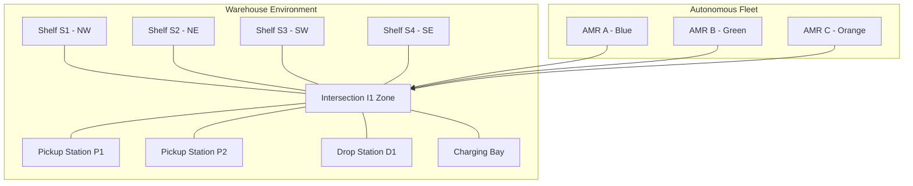

# 🏭 Industrial Multi-AMR Warehouse Simulation

A competition-ready, high-fidelity **Autonomous Mobile Robot (AMR)** logistics simulation built on **Gazebo Sim** (SDF 1.9) with full **ROS 2** integration support.

Designed for testing fleet management, multi-agent path planning, collision avoidance, and warehouse material handling across diverse operating systems (**macOS, Linux, Windows**).

---

## 📋 Table of Contents
1. [Project Overview](#-project-overview)
2. [Required Software & Prerequisites](#-required-software--prerequisites)
3. [Installation & Setup by OS](#-installation--setup-by-os)
   - [macOS (Apple Silicon & Intel)](#1-macos-apple-silicon--intel)
   - [Ubuntu / Debian Linux](#2-ubuntu--debian-linux)
   - [Windows (WSL2 & Native)](#3-windows-wsl2--native)
4. [Quick Start & Running the Simulation](#-quick-start--running-the-simulation)
5. [Warehouse Zone & Coordinate Map](#-warehouse-zone--coordinate-map)
6. [Active AMR Fleet & ROS 2 / Gazebo Topic Interface](#-active-amr-fleet--ros-2--gazebo-topic-interface)
7. [Directory Structure & Model Catalog](#-directory-structure--model-catalog)
8. [Troubleshooting & Platform FAQs](#-troubleshooting--platform-faqs)

---

## 🌟 Project Overview

This simulation replicates a real-world automated logistics fulfillment center featuring:
- **3 Color-Coded AMRs** with distinct namespaces (`amr_a`, `amr_b`, `amr_c`), 2D planar LiDARs, differential-drive controllers, and wheel odometry.
- **Dedicated Staging Zones**: 2 Intake Pickup Stations (**P1**, **P2**), an Order Packing/Drop Station (**D1**), an Automated Wireless Charging Bay, and a critical central traffic intersection (**I1**).
- **Industrial Storage Racks**: 4 High-Bay Shelving Units (**S1**, **S2**, **S3**, **S4**) with stacked pallet cargo boxes and high-contrast identification numbers.
- **Safety Navigation Markings**: 5m × 5m concrete floor grid, directional traffic flow arrows, wall skirting, I-beam perimeter structural pillars, and wall-mounted industrial LED lighting.



---

## 📦 Required Software & Prerequisites

| Software | Recommended Version | Purpose |
| :--- | :--- | :--- |
| **Gazebo Sim** | **Harmonic** (or Garden / Fortress) | Physics engine, sensor simulation & 3D rendering |
| **Python** | **3.8+** | Universal cross-platform launcher & automation scripts |
| **ROS 2** *(Optional)* | **Humble** / **Iron** / **Jazzy** | Robot navigation, path planning, and SLAM nodes |
| **ros_gz_bridge** *(Optional)* | Compatible with ROS 2 distro | Bridges Gazebo topics to ROS 2 standard messages |

---

## 💻 Installation & Setup by OS

### 1. macOS (Apple Silicon & Intel)
Install Gazebo Sim using Homebrew:
```bash
# 1. Install Homebrew (if not already installed)
/bin/bash -c "$(curl -fsSL https://raw.githubusercontent.com/Homebrew/install/HEAD/install.sh)"

# 2. Add Open Robotics tap and install Gazebo Harmonic
brew tap osrf/simulation
brew install gz-harmonic

# 3. macOS Networking Route (Required once per session for local IPC communication)
sudo route change -net 224.0.0.0/4 127.0.0.1
# Note: If it says "not in table", run:
# sudo route add -net 224.0.0.0/4 127.0.0.1
```

### 2. Ubuntu / Debian Linux
Install Gazebo Harmonic via the official OSRF package repository:
```bash
# 1. Install prerequisites
sudo apt-get update && sudo apt-get install -y curl lsb-release gnupg

# 2. Add OSRF repository key & source
sudo curl https://packages.osrfoundation.org/gazebo.gpg --output /usr/share/keyrings/pkgs-osrf-archive-keyring.gpg
echo "deb [arch=$(dpkg --print-architecture) signed-by=/usr/share/keyrings/pkgs-osrf-archive-keyring.gpg] http://packages.osrfoundation.org/gazebo/ubuntu-stable $(lsb_release -cs) main" | sudo tee /etc/apt/sources.list.d/gazebo-stable.list > /dev/null

# 3. Install Gazebo Harmonic
sudo apt-get update
sudo apt-get install -y gz-harmonic python3
```

### 3. Windows (WSL2 & Native)
#### Option A: WSL2 Ubuntu (Recommended)
1. Open PowerShell and install Ubuntu WSL2: `wsl --install -d Ubuntu-22.04`
2. Follow the **Ubuntu / Debian Linux** steps above inside the WSL2 terminal.
3. Use WSLg for hardware-accelerated GUI rendering.

#### Option B: Native Windows
1. Download Gazebo Sim binary installer from [Gazebo Sim Windows Releases](https://gazebosim.org/docs/harmonic/install_windows).
2. Ensure `gz` is added to your System `PATH` environment variable.
3. Install [Python 3](https://www.python.org/downloads/).

---

## 🚀 Quick Start & Running the Simulation

We provide dedicated cross-platform launchers so you never have to manually configure paths or environment variables:

### 🌟 Universal Python Launcher (Works on macOS, Linux, Windows)
```bash
# Launch Server + GUI automatically
python3 scripts/launch_sim.py

# Headless / Physics Server only
python3 scripts/launch_sim.py --server

# GUI Client only (connect to active server)
python3 scripts/launch_sim.py --gui
```

---

### 🐧 Linux & 🍎 macOS (POSIX Shell)
```bash
# Full Simulation (Server + GUI)
./scripts/launch_sim.sh

# Headless mode
./scripts/launch_sim.sh --server

# GUI Client only
./scripts/launch_sim.sh --gui
```

---

### 🪟 Windows (Command Prompt & PowerShell)

**Command Prompt (`cmd.exe`):**
```cmd
scripts\launch_sim.bat
```

**PowerShell:**
```powershell
.\scripts\launch_sim.ps1
```

---

## 🗺️ Warehouse Zone & Coordinate Map

The warehouse is enclosed in a **20.0m × 15.0m × 2.5m** perimeter. Origin `(0, 0, 0)` is at the geometric center of the concrete floor.

| Zone / Asset | Coordinates `(X, Y, Z)` | Visual Marker | Functional Purpose |
| :--- | :--- | :--- | :--- |
| **Pickup Station P1** | `(0.0, -3.2, 0.0)` | 🟢 Emerald Green **P** | Primary intake staging pad |
| **Pickup Station P2** | `(-5.5, -4.5, 0.0)` | 🟢 Emerald Green **P** | Auxiliary cargo receiving bay |
| **Drop Station D1** | `(0.0, -5.6, 0.0)` | 🔵 Royal Blue **D** | Packing, sorting, and dispatch area |
| **Charging Station** | `(5.5, -5.0, 0.0)` | 🟡 Gold Battery + ⚡ Bolt | Autonomous induction docking station |
| **Intersection I1** | `(0.0, 1.75, 0.0)` | 🔴 Red Cross + Bollards | High-traffic central aisle intersection |
| **Shelf Rack S1 (NW)**| `(-4.8, 4.5, 0.0)` | ⬛ Black **S1** (on top) | High-bay pallet inventory rack 1 |
| **Shelf Rack S2 (NE)**| `(4.8, 4.5, 0.0)` | ⬛ Black **S2** (on top) | High-bay pallet inventory rack 2 |
| **Shelf Rack S3 (SW)**| `(-4.8, -1.0, 0.0)`| ⬛ Black **S3** (on top) | High-bay pallet inventory rack 3 |
| **Shelf Rack S4 (SE)**| `(4.8, -1.0, 0.0)`| ⬛ Black **S4** (on top) | High-bay pallet inventory rack 4 |

---

## 🤖 Active AMR Fleet & ROS 2 / Gazebo Topic Interface

All 3 AMRs operate under isolated namespaces to support true multi-robot decentralized control:

```
                  ┌───────────────────────────────┐
                  │    Warehouse Simulation       │
                  └──────────────┬────────────────┘
         ┌───────────────────────┼───────────────────────┐
         ▼                       ▼                       ▼
   [ AMR A (Blue) ]        [ AMR B (Green) ]       [ AMR C (Orange) ]
   /amr_a/cmd_vel          /amr_b/cmd_vel          /amr_c/cmd_vel
   /amr_a/odometry         /amr_b/odometry         /amr_c/odometry
   /amr_a/scan             /amr_b/scan             /amr_c/scan
   /amr_a/tf               /amr_b/tf               /amr_c/tf
```

### Fleet Topic Specifications

| Robot | Theme | Spawn `(X, Y)` | Velocity Control (Pub) | Odometry Feedback (Sub) | 2D LiDAR (Sub) |
| :--- | :--- | :--- | :--- | :--- | :--- |
| **AMR A** | 🔵 Sapphire Blue | `(-6.0, 0.0)` | `/amr_a/cmd_vel` | `/amr_a/odometry` | `/amr_a/scan` |
| **AMR B** | 🟢 Emerald Green | `(0.0, -0.5)` | `/amr_b/cmd_vel` | `/amr_b/odometry` | `/amr_b/scan` |
| **AMR C** | 🟠 Safety Orange | `(6.0, -2.5)` | `/amr_c/cmd_vel` | `/amr_c/odometry` | `/amr_c/scan` |

### Sample Velocity Commands (Gazebo CLI)

```bash
# Drive AMR A (Blue) forward at 0.5 m/s
gz topic -t "/amr_a/cmd_vel" -m gz.msgs.Twist -p "linear: {x: 0.5}, angular: {z: 0.0}"

# Rotate AMR B (Green) counter-clockwise at 0.8 rad/s
gz topic -t "/amr_b/cmd_vel" -m gz.msgs.Twist -p "linear: {x: 0.0}, angular: {z: 0.8}"

# Stop AMR C (Orange)
gz topic -t "/amr_c/cmd_vel" -m gz.msgs.Twist -p "linear: {x: 0.0}, angular: {z: 0.0}"
```

---

## 📁 Directory Structure & Model Catalog

```
gazebo/
├── README.md                       # Comprehensive master documentation
├── scripts/                        # Cross-platform simulation execution scripts
│   ├── launch_sim.py               # Universal launcher (macOS, Linux, Windows)
│   ├── launch_sim.sh               # POSIX Bash launcher (macOS / Linux)
│   ├── launch_sim.bat              # Windows Command Prompt batch script
│   └── launch_sim.ps1              # Windows PowerShell script
└── simulation/
    ├── models/                     # Modular simulation models (SDF 1.9)
    │   ├── amr/                    # Base AMR model template with lidar & diff-drive
    │   ├── amr_blue/               # AMR A model instance (/amr_a)
    │   ├── amr_green/              # AMR B model instance (/amr_b)
    │   ├── amr_orange/             # AMR C model instance (/amr_c)
    │   ├── shelf/                  # 3-tier industrial warehouse rack with cargo boxes
    │   ├── pickup_station/         # Floor intake staging zone with 45° hazard lines
    │   ├── drop_station/           # Floor discharge zone with 45° hazard lines
    │   ├── charging_station/       # Induction charging dock with status LED indicator
    │   ├── pallet_stack/           # Stack of wooden logistics pallets
    │   ├── dumpster/               # Industrial recycling disposal container
    │   └── obstacle/               # Safety bollard obstacle
    └── worlds/
        ├── warehouse.sdf           # Master competition warehouse world
        └── amr_test.sdf            # Lightweight single-robot testing ground
```

---

## 🔧 Troubleshooting & Platform FAQs

### 1. `gz sim: command not found`
- **Linux:** Ensure Gazebo Harmonic is installed: `sudo apt install gz-harmonic`
- **macOS:** Ensure Homebrew path is in your shell profile: `brew install gz-harmonic`
- **Windows:** Add `C:\Program Files\condabin` or your Gazebo installation path to Environment Variable `Path`.

### 2. macOS: GUI opens but displays a blank window or fails to connect
On macOS, loopback multicast routing must be directed to `127.0.0.1`:
```bash
sudo route change -net 224.0.0.0/4 127.0.0.1
```
Then use the provided launcher: `./scripts/launch_sim.py`.

### 3. Model meshes or textures not showing
The launchers automatically set `GZ_SIM_RESOURCE_PATH` to `<project_root>/simulation/models`. If running `gz sim` manually, export it first:
```bash
export GZ_SIM_RESOURCE_PATH="$(pwd)/simulation/models:$GZ_SIM_RESOURCE_PATH"
```
